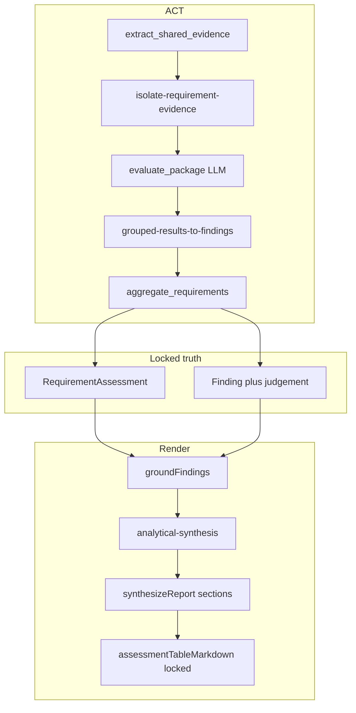

# Analysis Module — Deep Dive (for counsel + Claude review)

> **Purpose of this document.** One place to understand how the CookieCare analysis module actually works today: request → PAC phases → ACT graph → locked judgements → narrative/table render. Use it to audit fidelity line by line, not as marketing copy.
>
> **Companion docs.** [`OVERVIEW.md`](./OVERVIEW.md) (short current objective), [`PIPELINE-ISSUES.md`](./PIPELINE-ISSUES.md) (historical failure cases), [`CONTRIBUTING.md`](./CONTRIBUTING.md) (where new code belongs).
>
> **Base path.** All paths below are under `backend/src/modules/analysis/` unless noted.
>
> **Last fidelity work covered here.** Locked-findings fidelity: table cells come from locked assessments; isolation no longer wipes Present into Cannot determine; substance + cross-ref stays Present; partial+high no longer displays as Gap.

---

## 1. What this module is supposed to do

Counsel uploads one or more contracts, asks a question (e.g. “Art 28 mandatory clauses — table”), and gets a grounded memo or table.

The product promise is **not** “an LLM essay about the DPA.” It is:

1. **Canonical findings** — what is true about each requirement (status, evidence, recommendation kind), locked after ACT.
2. **Analytical synthesis** — what those locked rows *mean* (themes, residual uncertainty). May interpret; must not change status.
3. **Renderer** — how to tell the user (narrative vs table). Must consume the same locked objects in both modes.

If narrative says Present and the table says Gap for the same requirement, the architecture has failed — regardless of how good either paragraph sounds.

---

## 2. End-to-end request path (outside → inside)

```text
Frontend (Analyze / InteractAnalyze)
  → POST /api/... analysis job (CREATE or RESUME_ASK)
  → jobQueue: type "analysis_pac"
  → entry/analysis-workflow.ts
  → PacController.run(state)
  → PLAN → (ASK?) → ACT → (AUDIT if deep) → DONE
  → persist + stream tokens to UI
```

| Layer | Path | Role |
|-------|------|------|
| HTTP | `api/controller.ts`, `api/route.ts`, `api/schema.ts` | Enqueue CREATE / RESUME_ASK; read session/history |
| Job | `backend/src/services/jobs/handlers/analysis-handler.ts` (outside module) | Runs PAC inside job worker |
| Entry | `entry/analysis-workflow.ts` | Seeds `AnalysisProfile` (lite/deep), conversation, then PAC |
| Loop | `pac/controller.ts` | Owns phases; LLM never chooses the next phase |
| Persist | `capabilities/persist/persist-analysis.ts` | Writes conversation / ledger on DONE |

**Lite vs deep** (`pac/analysis-profile.ts`):

| Mode | Flow |
|------|------|
| Lite | `PLAN → ACT → DONE` |
| Deep | `PLAN → ACT → AUDIT → DONE` |

Neither mode re-enters ACT. `CRITIQUE_PAUSED = true` in `pac/transitions.ts`: critique redo loops are retired. Deep = grounding AUDIT only, not a rewrite loop.

---

## 3. PAC phase machine (what each phase does)

Source of truth: `pac/controller.ts` + `pac/transitions.ts` + `pac/policy.ts` + `pac/types.ts`.

### 3.1 PLAN

1. `capabilities/plan/classify-intent.ts` — classify instruction into closed axes (scope, operation, standard, outputForm, requirements, clarifications).
2. Heuristics / defaults — `intent-heuristics.ts`, `intent-sensible-defaults.ts`, `intent-requirement-normalize.ts`, `follow-up-intent.ts`.
3. Skill selection — `skills/runtime/selection/select-skills.ts`, `resolve-skills.ts` (doc-type force-include matters for DPA/NDA).
4. Focus — `skills/runtime/focus/extract-instruction-focus.ts` + catalog shortlist.
5. `capabilities/plan/build-plan.ts` — hydrate skills, resolve packages, build ACT work-unit graph, assemble `ReportSpec` / outline.
6. Transition: clarifications → **ASK**; else → **ACT**; out-of-scope / budget → **DONE**.

### 3.2 ASK

`capabilities/ask/ask-user.ts` pauses the run (`awaiting_user`). Resume re-enters at **PLAN**.

### 3.3 ACT

`capabilities/act/execute-act-plan.ts` runs the work-unit DAG in topological batches. Parallel-safe tools include `evaluate_package`, `check_against_rule`, `evaluate_matrix_row`, `flag_risk`.

Typical package path (built by `skills/runtime/graph/build-act-graph.ts`):

```text
classify_document / extract_clauses (shared front matter)
  → per package:
       inventory_provisions? → extract_shared_evidence → evaluate_package
  → leftover matrix rows → evaluate_matrix_row
  → optional legacy: check_against_rule, check_expected_clauses, flag_risk, web_assisted_reference
  → derive_risk
  → aggregate_requirements   ← locks RequirementAssessment[]
  → render_output            ← ground → analytical synthesis → section write → locked tables
```

After ACT: deep → **AUDIT**; lite → **DONE**.

### 3.4 AUDIT (deep only)

`capabilities/audit/run-audit.ts` → `ground-findings.ts` again + optional verification notes. **Does not rewrite** locked findings or the memo body. Then **DONE**.

### 3.5 CRITIQUE (code present, loop retired)

`capabilities/critique/*` still exists (validators, release-decision, targeted repair). PAC `case "CRITIQUE"` logs retired and goes DONE. Do not design new features that assume critique redo.

### 3.6 DONE

`persist-analysis` + stop reason (`green`, `awaiting_user`, `budget_exceeded`, etc.).

---

## 4. Three-layer architecture (the invariant you should audit against)



| Layer | What it is | What it must not do |
|-------|------------|---------------------|
| Canonical findings / judgements | `Finding` + optional `judgement` axes; aggregated into `RequirementAssessment` | Be reinvented by the writer |
| Analytical synthesis | Themes, significance, residual uncertainty over locked rows | Change compliance / invent gaps / invent evidence |
| Renderer | Narrative prose or locked markdown table | Invent Status / Evidence / Finding cells in table mode |

**Display labels** (user-facing Status words): Strong · Present & adequate · Present, particulars in schedule · Minor drafting gap · Gap · Cannot determine · Not applicable.

Defined in `models/requirement-assessment.ts` (`displayFromJudgement`, `displayRequirementStatus`).

---

## 5. Status model (read this carefully — most “Cannot determine” bugs live here)

### 5.1 Axes on `RequirementJudgement`

| Axis | Values | Meaning |
|------|--------|---------|
| `compliance` | present \| partial \| gap \| insufficient_evidence \| not_applicable | Does the *contract* satisfy the legal requirement? |
| `evidenceState` | direct \| incorporated \| truncated \| unavailable \| conflicting \| not_found | What evidence we actually have |
| `referenceBinding` | binding \| floating \| none | Strength of annex/schedule pointer |
| `nli` | entailed \| contradicted \| not_mentioned | Does the extract support the *hypothesis*? **Never equals compliance** |
| `draftingQuality` | clean \| could_be_clearer \| operational_weakness | Optional; present/partial only |
| `materiality` | low \| medium \| high | How serious residual issues are |
| `recommendationKind` | none \| obtain \| confirm \| clarify \| amend | Deterministic from axes |

**NLI ≠ compliance.** Example: text can *entail* “processor provides audit information” while compliance is still `partial` because inspection is missing.

**Floating pointer ≠ Present.** A bare “see Schedule X” with no contractual substance → `insufficient_evidence` → display **Cannot determine**, recommendation **Obtain**, never **Amend**.

**Substance + cross-ref ≠ Gap.** “Duration is the term of the Agreement / as set forth in the Agreement” has substance → stay **Present** (or Present, particulars in schedule), Obtain/Confirm the Agreement — do not wipe to Cannot determine solely because the Agreement was not uploaded.

### 5.2 Projection to legacy `RequirementStatus`

`statusFromJudgement` maps axes → strong / adequate / conditional / gap / cannot_determine / not_applicable for older consumers. Writers and tables should prefer `displayRequirementStatus(assessment)` which uses `judgement` when present.

### 5.3 Display rules that have bitten us

| Situation | Correct display | Wrong display we have shipped |
|-----------|-----------------|--------------------------------|
| Complete quote + obligation present | Present & adequate / Strong | Cannot determine |
| Present + binding particulars in schedule | Present, particulars in schedule | Minor drafting gap / Gap |
| Floating pointer only | Cannot determine | Present / Minor drafting gap |
| Partial drafting residual (e.g. audit inspection) | Minor drafting gap | Gap (when materiality=high was auto-mapped) |
| Truncated / heading-only extract | Cannot determine + Obtain | Gap + Amend |
| Narrative vs table disagree | Impossible if both use locked rows | Happened when LLM table was kept |

### 5.4 Where axes are produced

1. LLM returns axes in `evaluate_package` (`prompts/evaluate-package.ts`).
2. `isolateAndNormalize` in `evaluate-package.ts` filters/recovers cites; may force insufficient **only** when there is truly no cite and coverage should not be preserved.
3. `grouped-results-to-findings.ts` → `judgementForResult` applies truncated/annex/substance policy and stamps `Finding.judgement`.
4. `aggregate-requirements.ts` + `requirement-status-policy.ts` lock `RequirementAssessment` (prefer stamped judgement).
5. `ground-findings.ts` may downgrade ungrounded / sibling-bleed claims (not a full re-eval).
6. Renderer prints `displayRequirementStatus(assessment)`.

---

## 6. Evidence path (how quotes get to a requirement)

### 6.1 Shared extraction

`extract-shared-evidence.ts` + `locate-evidence.ts` + `segmentation/segment-document.ts` build a `SharedEvidenceBundle` per package: items with `ref` (E1…), `clauseType`, `quotedText`, optional `truncated` / `evidenceStatus: referenced_elsewhere`.

### 6.2 Isolation (per-requirement candidates)

`isolate-requirement-evidence.ts`:

- `hintsForRequirement` — authored `evidenceHints` + hypothesis tokens + overlapping extraction targets.
- `candidateRefsByRequirement` — score each extract against each requirement’s hints. **An extract may be a candidate for more than one requirement** (sibling exclusive assignment was too aggressive and wiped duration when purpose also matched).
- `validateEvidenceRefs` / `resolveEvidenceRefsForRequirement` — keep cites that score on this hypothesis; if the model’s cites were filtered, recover hint-matching package extracts.
- `coverageShouldBePreserved` — do not force insufficient when the model already said present/partial.

Skill-authored hints live on packages in e.g. `skills/regimes/data-protection/gdpr/skill.config.ts` (`requirementEvidence`). Isolation cannot find what it is not hinted to find — weak hints → empty candidates → overuse of Cannot determine.

### 6.3 Grouped evaluation (one LLM call per package)

`evaluate-package.ts`:

- Builds prompt with **per-requirement hypothesis + candidateEvidenceRefs**.
- Model returns one result per `requirementId` (axes + rationale + evidenceRefs).
- Results are **not** the persisted source of truth — they become Findings.

Prompt rules that matter (`prompts/evaluate-package.ts`):

- NLI separate from compliance.
- Baseline substance in this instrument is Present even if particulars live in a named agreement/schedule.
- Missing granular lists in a disclosure → Obtain, not Gap.
- Truncated / heading_only → never Gap / Amend.
- Do not copy sibling rationale or cites.

### 6.4 Conversion + aggregation

- `grouped-results-to-findings.ts` — Findings + judgements; annex/substance policy; partial may emit present + gap sibling findings.
- `aggregate-requirements.ts` — one locked assessment per PLAN requirement.
- `shared/article-linkage.ts` — lettered Art 28(3)(x) rows must not inherit wrong parent-article findings / quotes.

### 6.5 Grounding

`capabilities/audit/ground-findings.ts` (also called **before** synthesis inside `render-output`):

- Quote not in source → flag / downgrade.
- Duplicate sibling quote bleed → downgrade.
- Amend-from-incomplete-evidence → soft.
- Invalid path = flag, **not** critique redo.

---

## 7. Render path (why narrative and table used to disagree)

### 7.1 Entry

`capabilities/act/render-output.ts` re-exports `capabilities/reporting/render-output.ts`.

### 7.2 Order inside render

1. Filter / consolidate findings; matrix-focus filters.
2. **`groundFindings`** (always, before writer).
3. Attach rights-matrix artifact when tabular / asked.
4. If assessments exist → `synthesizeReport`:
   - `runAnalyticalSynthesis` once on locked rows (`analytical-synthesis.ts` + `prompts/analytical-synthesis.ts`).
   - Parallel section writes (`synthesize-report.ts` + `prompts/synthesis.ts`), streamed in outline order (`utils/ordered-section-stream.ts`).
5. `enforceAnswerStyleLayout`:
   - **Tabular:** strip LLM findings tables; inject `assessmentTableMarkdown` from locked `requirementAssessments` (scoped by outline `requirementIds`). Keep at most one lead sentence of prose.
   - **Narrative:** at most one markdown table if any (prefer rights-matrix artifact).

### 7.3 Locked table shape

```text
| Requirement | Status | Evidence | Finding |
```

- Status = `displayRequirementStatus(assessment)`
- Evidence = that row’s supporting finding quote (or “No verbatim extract” / particulars phrasing) — **never** another row’s quote
- Finding = that row’s claim/summary

### 7.4 What was broken (fixed in locked-findings fidelity)

Old behavior: if the section writer already emitted a markdown table, `injectAssessmentTableIntoSections` **kept it** (`if (countMarkdownTables(body) > 0) continue`). The LLM could invent Gap / wrong quotes. Narrative used locked labels; table did not.

New behavior: tabular mode **replaces** those tables with locked `assessmentTableMarkdown`. Synthesis prompts tell the model not to invent Status/Evidence/Finding cells.

Golden proof: `skills/__fixtures__/golden-cisco-dpa-art28-obligation.test.ts` — LLM table saying Gap for duration is replaced by locked Present + that row’s duration quote.

---

## 8. Folder map (what lives where)

| Folder | Owns |
|--------|------|
| `pac/` | Phase machine, profiles, budgets |
| `entry/` | Public CREATE / RESUME entry |
| `api/` | HTTP enqueue + session |
| `capabilities/plan/` | Intent, outline, buildPlan |
| `capabilities/act/` | Work-unit handlers + executeActPlan |
| `capabilities/audit/` | Deep grounding phase |
| `capabilities/reporting/` | Synthesis, locked tables, limitations |
| `capabilities/critique/` | Legacy validators (PAC loop paused) |
| `capabilities/ask/` | Clarification pause |
| `capabilities/persist/` | DONE persistence |
| `models/` | Domain types |
| `prompts/` | Prompt strings (no business policy in handlers if avoidable) |
| `skills/` | Authored law + `runtime/` engine |
| `shared/` | Cross-phase pure helpers |
| `utils/` | Topo batches, stream, ceilings, pac-log |
| `taxonomies/` | Versioned clause/risk enums |
| `segmentation/` | Document segments / locators |
| `memory/` | Conversation store; routing bias only |
| `docs/` | This file and companions |
| `*/__fixtures__/` | Deterministic tests (ship gate for fidelity) |

**Dependency rules** (`CONTRIBUTING.md`):

- New ACT tool → `capabilities/act/`; register in `execute-act-plan.ts`.
- New prompt → `prompts/`.
- Generic handlers must not hard-code GDPR/NDA tokens (`generic-handler-domain-lint.test.ts`). Law lives in skills.
- `skills/` must not import `capabilities/` (except documented exceptions).
- `prompts/` may import `models/` / `shared/` only.

---

## 9. Important files — what each does (audit checklist)

### 9.1 PAC / entry / API

| File | What it does |
|------|----------------|
| `pac/controller.ts` | Phase loop; PLAN classify+buildPlan; ACT execute; AUDIT; retire CRITIQUE |
| `pac/transitions.ts` | Pure next-phase; `CRITIQUE_PAUSED` |
| `pac/policy.ts` | mustAskUser, budgets, out-of-scope |
| `pac/analysis-profile.ts` | Lite vs deep thinking / budgets |
| `pac/types.ts` | Phase, AgentRunState |
| `entry/analysis-workflow.ts` | Seed state + run PAC |
| `api/controller.ts` | HTTP → job |
| `capabilities/index.ts` | Wires PacCapabilities |

### 9.2 PLAN

| File | What it does |
|------|----------------|
| `capabilities/plan/classify-intent.ts` | Intent LLM |
| `capabilities/plan/build-plan.ts` | Skills + graph + reportSpec |
| `capabilities/plan/intent-heuristics.ts` | Doc-type / “analyse” upgrades |
| `capabilities/plan/inject-authored-requirements.ts` | Skill-authored requirements |
| `capabilities/plan/resolve-document-roles.ts` | Target vs playbook/reference |
| `capabilities/plan/derive-report-outline.ts` | Deterministic outline |
| `capabilities/plan/refine-report-outline.ts` | Optional LLM outline refine |
| `capabilities/plan/follow-up-intent.ts` | Follow-up / presentation_change |
| `capabilities/plan/resolve-report-spec.ts` | Merge package report blocks |

### 9.3 Skills runtime

| File | What it does |
|------|----------------|
| `skills/runtime/graph/resolve-packages.ts` | Requirement → authored package (no similarity assembly); suppress structural when peer eval selected |
| `skills/runtime/graph/build-act-graph.ts` | Work-unit DAG; passes `requirementEvidence` into eval units |
| `skills/runtime/selection/resolve-skills.ts` | Skill pick + doc-type force-include |
| `skills/runtime/focus/extract-instruction-focus.ts` | Focus + shortlist |
| `skills/runtime/catalog/registry.ts` | Merge configs |
| `skills/runtime/lint/lint-skill-parity.ts` | CI parity |
| `skills/regimes/data-protection/gdpr/skill.config.ts` | Art 28 packages, hypotheses, hints |
| `skills/doc-types/dpa/skill.config.ts` | DPA packages; `suppressWhenPeerEvaluation` on structural_review |
| `skills/doc-types/nda/skill.config.ts` | NDA rules/risks |

### 9.4 ACT core (fidelity-critical)

| File | What it does |
|------|----------------|
| `execute-act-plan.ts` | Batch orchestrator + tool switch |
| `extract-shared-evidence.ts` | Package evidence bundle |
| `isolate-requirement-evidence.ts` | Per-req candidates; recover cites; preserve coverage |
| `evaluate-package.ts` | Grouped LLM eval + isolateAndNormalize |
| `grouped-results-to-findings.ts` | Results → Findings; substance/annex policy |
| `aggregate-requirements.ts` | Lock assessments |
| `requirement-status-policy.ts` | Derive judgement/status from findings when unstamped |
| `locate-evidence.ts` | Heading/alias locate; expand truncated sections |
| `check-against-rule.ts` | Per-rule path (must stamp `requirementId` or aggregation bridge fails) |
| `evaluate-matrix-row.ts` | Rights-matrix rows |
| `flag-risk.ts` / `derive-risk.ts` | Risks |
| `ground-findings` (via reporting/audit) | Deterministic grounding |
| `render-output.ts` (act) | Re-export reporting |

### 9.5 Reporting

| File | What it does |
|------|----------------|
| `reporting/render-output.ts` | Ground → synth → stream → **locked tables** |
| `reporting/synthesize-report.ts` | Analytical synthesis + parallel sections |
| `reporting/analytical-synthesis.ts` | Interpret locked rows only |
| `reporting/unsupported-inference.ts` | Gap language without locked gap rows |
| `reporting/finalize-report-spec.ts` | Final outline before write |
| `prompts/synthesis.ts` | Section writer; tabular = no invent tables |
| `prompts/analytical-synthesis.ts` | Interpretation contract |
| `prompts/memo-markdown-craft.ts` | Status words; tabular craft |
| `prompts/evaluate-package.ts` | Eval axes contract |

### 9.6 Models

| File | What it does |
|------|----------------|
| `models/analysis-state.ts` | Whole run state |
| `models/finding.ts` | Atomic claim + optional judgement |
| `models/requirement-assessment.ts` | Axes, display, assessments |
| `models/evidence-package.ts` | Packages + shared evidence types |
| `models/intent.ts` | Intent + ReportSpec + outline |
| `models/analysis-plan.ts` | Work units / focus |
| `models/analytical-synthesis.ts` | Synthesis type |
| `models/audit-report.ts` | Audit deltas |
| `models/locator.ts` | EvidenceSpan |

### 9.7 Shared / utils / segmentation / taxonomies

| File | What it does |
|------|----------------|
| `shared/article-linkage.ts` | Requirement↔finding grain; bleed prevention |
| `shared/group-assessments.ts` | Theme grouping + `humanizeRequirementId` |
| `shared/text-normalize.ts` | Quote normalize for grounding |
| `utils/topo-batches.ts` | Dependency batches |
| `utils/ordered-section-stream.ts` | Outline-order streaming |
| `utils/resolve-synthesis-ceiling.ts` | Per-section token caps |
| `utils/pac-log.ts` | Structured logs + token emit |
| `segmentation/segment-document.ts` | Segments + resolveSpan |
| `taxonomies/*` | Versioned enums |

---

## 10. Cisco / Art 28 review map (how to audit a live run)

Counsel’s expected high-level results for a Cisco-like DPA (deterministic golden uses extracts, not a live PDF call):

| Requirement | Expected high-level |
|-------------|---------------------|
| Subject matter | Present / evidence-dependent for granular Offer Disclosure details |
| Duration | Present / Agreement verification dependency — **not** Cannot determine |
| Nature / purpose | Present or Partial; not Gap from “not fully enumerated” |
| Data categories / subjects | Insufficient evidence if only disclosure pointer |
| Controller obligations | Present if §2.3-style duties exist in-text |
| 28(3)(b) confidentiality | Present |
| 28(3)(e)/(f) assistance | Present / strong |
| 28(3)(g) return/delete | Present / strong |
| 28(3)(d) subprocessors | Present / strong (notice + object + liability) — **not** Amend |
| 28(3)(h) audit | Partial / Minor drafting gap if info+certs but no clear inspection |

**How to verify a live run against architecture:**

1. Inspect PAC log / inspect dump for `requirementAssessments` — locked `compliance`, `evidenceState`, `recommendationKind`, supporting quotes.
2. Compare narrative Status words to those locked labels.
3. Compare every table Status / Evidence cell to the same locked objects (must match after fidelity fix).
4. If locked row is already wrong → bug is in **eval / isolation / judgement**, not the writer.
5. If locked row is right but output differs → bug is in **render / prompts**.

Golden file: `skills/__fixtures__/golden-cisco-dpa-art28-obligation.test.ts`.

---

## 11. Where we are still lacking (honest gap list)

Use this as the review backlog. Distinguish **architecture debt** from **content/skill debt**.

### 11.1 Analysis honesty (still the hard problem)

Even with locked tables, the system can lock the **wrong** judgement if:

- Evidence isolation misses the right extract (weak `evidenceHints`, bad locate, truncated section).
- The eval LLM over-conservatively marks Present clauses as insufficient_evidence (prompt + temperature variance).
- Annex heuristics mis-classify a substantive quote as pointer-only (or the reverse).
- Package coverage is incomplete (e.g. assistance / subprocessors under-surfaced in narrative because they were never locked Present).

**Symptom counsel described:** “Better at saying I don’t know; still doesn’t reliably know what it does know.”

### 11.2 Narrative quality (follow-on, not blocking locked tables)

Section writers still tend toward:

```text
Requirement → status → missing material → recommendation
```

Target counsel voice:

```text
What the contract establishes → how it maps to the legal test → what is genuinely missing → significance → residual uncertainty
```

Analytical synthesis exists but section prompts still under-use it for ChatGPT-quality legal interpretation. Fix is prompt craft on locked rows — **not** another ACT loop.

### 11.3 Non-package / NDA paths (`PIPELINE-ISSUES.md`)

Historical failures when package graph is not used:

- `check_against_rule` / `flag_risk` findings often lack `requirementId` → aggregation emits not_applicable placeholders.
- Intent heuristics can classify “Analyse + Identify” as `extract` / `qa_answer` → thin outline.
- Brief-summary renderer path historically GDPR-article-shaped.

Several of these have patches; still treat non-package docs as higher risk until every finding stamps `requirementId` or aggregation always uses `requirementMappings`.

### 11.4 Critique / release UX

CRITIQUE is paused. Old “blocked” delivery of bad first-pass output is less relevant, but limitations / withhold UX for incomplete evidence still needs product clarity (Obtain list vs silent Cannot determine).

### 11.5 Skill / catalog gaps

- Authored packages are first-class; similarity assembly is forbidden — so missing packages = blank analysis, not creative fill.
- NDA survival / commercial gaps still catalog-sensitive.
- Generic handlers correctly forbid GDPR tokens — so **all** Art 28 wording must stay in GDPR skill config / SKILL.md.

### 11.6 Upload / infra (adjacent, not analysis logic)

`npm run dev` historically hung on `setupDb` (`CREATE EXTENSION vector` / exclusive locks). Setup now skips full DDL when schema exists. Upload “Uploading…” freezes if `file_processing` jobs hang on DB locks or wait forever — separate from judgement fidelity but confuses live review.

---

## 12. Mental model for a line-by-line review

When reading a bad output, walk this ladder **in order**:

1. **Did PLAN select the right skills/packages/requirements?**  
   If wrong package set → fix selection / skill config, not the writer.
2. **Did shared evidence contain the right quotes?**  
   If missing → locate / expansion / extractionTargets / hints.
3. **Did isolation assign those quotes to the right requirement?**  
   If empty candidates → hints / scoring.
4. **What did evaluate_package return for axes?**  
   If LLM said gap incorrectly → prompt / hypothesis / candidate list.
5. **Did isolateAndNormalize or judgementForResult wipe Present?**  
   Check forceInsufficient / annex / substance policy.
6. **What is locked on RequirementAssessment?**  
   This is truth for both modes.
7. **Did grounding change anything?**  
   Sibling bleed / quote-not-in-source.
8. **Did analytical synthesis invent a new gap?**  
   Should be blocked by schema/prompt.
9. **Did the renderer print locked Status/Evidence?**  
   Table must not invent cells.
10. **Is the remaining gap narrative craft?**  
    Prompt only — do not unlock statuses.

---

## 13. Architecture invariants (do not break)

1. TypeScript owns PAC phases; LLM never chooses hops.
2. No ACT re-entry after ACT completes (lite or deep).
3. `CRITIQUE_PAUSED` — deep = AUDIT grounding only.
4. Packages are authored in skills; never assembled by similarity at runtime.
5. Generic handlers avoid hard-coded GDPR/NDA tokens.
6. `Finding` is source of truth; assessments are derived; writers must not mutate axes.
7. NLI ≠ compliance; floating refs ≠ Present; truncated ≠ Amend.
8. Tabular Status/Evidence/Finding cells come from locked assessments.
9. Tier separation: B authored / P playbook / C web — do not mix in one table.
10. Org memory biases routing only, never finding substance.

---

## 14. Key tests to run when changing fidelity

```bash
cd CookieCare-main/backend
npm run lint:skills
node --import ./node_modules/tsx/dist/loader.mjs --test \
  src/modules/analysis/skills/__fixtures__/golden-cisco-dpa-art28-obligation.test.ts \
  src/modules/analysis/capabilities/reporting/__fixtures__/answer-style-layout.test.ts \
  src/modules/analysis/capabilities/act/__fixtures__/isolate-requirement-evidence.test.ts \
  src/modules/analysis/capabilities/act/__fixtures__/requirement-status-policy.test.ts \
  src/modules/analysis/capabilities/audit/__fixtures__/ground-findings.test.ts \
  src/modules/analysis/capabilities/act/__fixtures__/generic-handler-domain-lint.test.ts
```

Full suite: `npm test` in `backend/` (one known unrelated phase-transitions CRITIQUE→ASK expectation may fail while CRITIQUE is paused — do not “fix” by re-enabling critique loops).

---

## 15. Glossary

| Term | Meaning |
|------|---------|
| PAC | Plan–Act–Critique style controller; critique paused |
| Work unit | One node in the ACT DAG (`evaluate_package`, etc.) |
| Package | Authored evidence+eval unit in a skill config |
| Finding | Atomic claim with evidence spans |
| Judgement | Locked two-axis (+rec) verdict on a finding/assessment |
| Assessment | Per PLAN requirement rollup |
| Isolation | Assigning candidate extracts per requirement |
| Grounding | Deterministic check that quotes exist / don’t bleed |
| Analytical synthesis | Interpretive layer over locked rows |
| Locked table | Renderer-built markdown table from assessments |

---

## 16. Suggested reading order (for you + Claude)

1. This file §§1–5 (architecture + status model).
2. `models/requirement-assessment.ts` (display + axes).
3. `prompts/evaluate-package.ts` + `capabilities/act/evaluate-package.ts` + `isolate-requirement-evidence.ts` + `grouped-results-to-findings.ts`.
4. `aggregate-requirements.ts` + `requirement-status-policy.ts`.
5. `capabilities/audit/ground-findings.ts`.
6. `capabilities/reporting/render-output.ts` (locked table inject) + `synthesize-report.ts` + `prompts/synthesis.ts`.
7. `skills/regimes/data-protection/gdpr/skill.config.ts` Art 28 packages.
8. `skills/__fixtures__/golden-cisco-dpa-art28-obligation.test.ts`.
9. `docs/PIPELINE-ISSUES.md` for non-DPA failure modes.
10. Live Cisco run: compare locked assessments dump vs narrative vs table cells.

If those three (locked / narrative / table) disagree, start at step 6 of §12. If they agree but counsel disagrees with the law, start at step 4–5 of §12.
