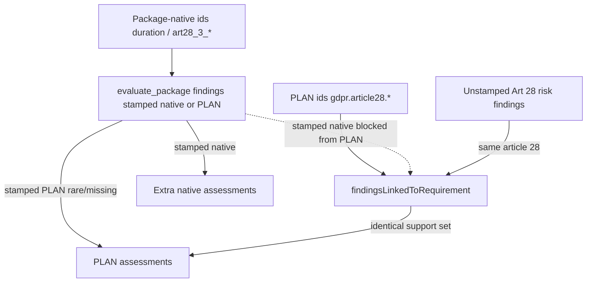

# ANALYSIS Point 1 — Evidence → Judgement → Aggregation Forensic

> **Scope.** Forensic investigation only (LORA Point 1). No production code was changed.
>
> **Evidence sources.** Live PAC logs jobs `e2ab71fe-…` and `7d8a5104-…` (Art 28 tabular DPA run); code under `backend/src/modules/analysis/`; deterministic reproduction probe (results below); golden fixtures in `skills/__fixtures__/golden-cisco-dpa-art28-obligation.test.ts`.
>
> **Companion.** [`PLAN-ACT-WALKTHROUGH-ART28-AND-RISK.md`](./PLAN-ACT-WALKTHROUGH-ART28-AND-RISK.md), [`ANALYSIS-MODULE-DEEP-DIVE.md`](./ANALYSIS-MODULE-DEEP-DIVE.md).

---

## A. Executive Diagnosis

The Cisco / Art 28 checklist ask fails **before the writer**. The renderer faithfully repeats a corrupted locked assessment set.

**Root failure (first incorrect state):**

```text
Package-native Present findings (e.g. requirementId="duration")
  are stamped to package-native ids
        ↓
PLAN assessments use ids like gdpr.article28.duration
        ↓
findingsLinkedToRequirement refuses stamped-other-id findings
  AND has no subprovision key on PLAN chapeau ids
        ↓
Same-article fallback attaches EVERY unstamped Art 28 risk finding
  to EVERY gdpr.article28.* PLAN row
        ↓
Risk findings are both isSupporting (status=present) and isGap (risk+severity)
        ↓
deriveRequirementJudgement takes the FIRST stamped judgement (often partial)
  OR complianceFromFindings → partial
        ↓
All six PLAN assessments lock as conditional with identical supportingFindingIds
  and identical summaries
        ↓
Table prints Minor drafting gap / shared narrative on every row
```

Meanwhile the **correct** native findings (`duration`, `art28_3_b_confidentiality`, …) either:

- appear as **extra** assessment rows (explains 6 PLAN → 8 assessments), or  
- never surface in the PLAN table at all.

This is **not** primarily an LLM creativity / outline problem. Isolation and substance upgrades in golden tests work for single-id rows. The live multi-id PLAN path **orphans** those Present findings and **floods** PLAN rows with shared risks.

---

## B. Current Data Flow

```text
PLAN classify
  → intent.requirements[] = gdpr.article28.{subject_matter,duration,…}
  → packages gdpr.art28.particulars + gdpr.art28.3.mandatory_clauses
  → package.requirementIds = [...authored natives, ...PLAN extras]
        ↓
extract_shared_evidence (truncated extracts common)
        ↓
candidateRefsByRequirement (non-exclusive; score by hints)
        ↓
evaluate_package LLM (sees many requirements in one JSON call)
        ↓
isolateAndNormalize / forceInsufficient (only if refs empty AND coverage not preserved)
        ↓
groupedResultsToFindings (stamps Finding.requirementId = result.requirementId)
        ↓
flag_risk / check_against_rule / derive_risk
  → often Findings WITHOUT requirementId, with Art 28 category/rule
        ↓
aggregate_requirements
  → orderedRequirementIds = PLAN ids first, then leftover finding.requirementIds
  → findingsForRequirement → findingsLinkedToRequirement  ★ CORRUPTION HERE
  → deriveRequirementJudgement  ★ FIRST STAMPED JUDGEMENT WINS
  → buildSummary from shared supporting set
        ↓
locked RequirementAssessment[]
        ↓
render / locked tables (faithful to lock)
```



---

## C. Requirement Trace (Cisco / Art 28)

| PLAN requirementId | Package | Package-native peer | Shared evidence | Isolation | Eval finding id stamp | Linked at aggregate | Locked status (live) |
|---|---|---|---|---|---|---|---|
| `gdpr.article28.subject_matter` | `gdpr.art28.particulars` | `subject_matter` | truncated particulars bundle | hint-scored candidates | native and/or PLAN | **unstamped Art 28 risks shared** | conditional |
| `gdpr.article28.duration` | same | `duration` | same | same | native `duration` Present **does not link** | **same 3 risks** | conditional |
| `gdpr.article28.nature_and_purpose` | same | `nature_purpose` | same | same | orphaned from PLAN | **same risks** | conditional |
| `gdpr.article28.categories_of_data_and_subjects` | same | `data_categories` / `data_subject_categories` | pointer/truncated | same | may leftover as native row | **same risks** | conditional |
| `gdpr.article28.controller_obligations_and_rights` | same | `controller_obligations_rights` | same | same | orphaned | **same risks** | conditional |
| `gdpr.article28.mandatory_clauses_completeness` | `gdpr.art28.3.mandatory_clauses` | lettered `art28_3_*` | truncated mandatory bundle | lettered isolation works **among letters** | lettered Present OK | PLAN id has **no letter key** → article-28 risk flood | conditional |

Live ACT INSPECT (`7d8a5104`): **8 assessments, all `conditional`**; first six share the same summary text; extras `data_categories`, `art28_3_h_audit`.

---

## D. Evidence Trace

### Deterministic probe (this investigation)

Constructed findings:

| findingId | requirementId | kind | Expected role |
|---|---|---|---|
| `f_native_duration` | `duration` | compliance Present | Should satisfy duration |
| `f_native_conf` | `art28_3_b_confidentiality` | compliance Present | Should satisfy confidentiality |
| `f_risk_chapeau` | _(none)_ | risk high | Art 28 chapeau category |
| `f_risk_audit` | _(none)_ | risk high | Art 28 audit category |
| `f_risk_sub` | _(none)_ | risk medium | Art 28.2 category |

**Linkage result for `gdpr.article28.duration`:**

```text
[ 'f_risk_chapeau', 'f_risk_audit', 'f_risk_sub' ]
native duration attached? false
```

**Every PLAN id got the exact same three risk findingIds.**

**Aggregation:**

| assessmentId | status | supportingFindingIds | summary prefix |
|---|---|---|---|
| all six `gdpr.article28.*` | conditional | f_risk_chapeau, f_risk_audit, f_risk_sub | “The agreement lacks complete processing particulars…” |
| `duration` | strong | f_native_duration | Duration is set forth… |
| `art28_3_b_confidentiality` | strong | f_native_conf | Confidentiality is present. |

This matches live: **identical PLAN summaries**, **findings=3**, **8 rows**, native Present surviving only as leftovers / conclusion prose.

### Live shared evidence (job `7d8a5104`)

```text
particulars: items=8 chars=12957 truncated=6
mandatory:   items=12 chars=19701 truncated=9
```

Truncation is a **contributing** cause of Obtain / insufficient on pointer rows, but it does **not** explain six identical conditional PLAN rows when native Present findings exist.

---

## E. Status Transition Trace

### Per-finding (package path — works in golden)

```text
LLM cannot_determine / gap
  + substance quote / binding annex language
→ grouped-results-to-findings judgementForResult
→ compliance present
→ Finding.status present + judgement stamped
```

### Per PLAN assessment (live path — breaks)

```text
Unstamped risk Finding.status=present, severity high/medium
  + category maps to Art 28 via activeSkills.regimeRules
→ findingsLinkedToRequirement(gdpr.article28.*) includes risk
→ isSupporting(risk)=true AND isGap(risk)=true
→ complianceFromFindings → partial
  OR deriveRequirementJudgement copies first risk.judgement (partial)
→ statusFromJudgement(partial) → conditional
→ display → Minor drafting gap / Cannot determine (axes-dependent)
```

### First incorrect state

**Aggregation linkage**, not isolation and not the section writer.

Chain:

```text
§ duration Present exists as Finding(requirementId="duration")
↓
NOT linked to gdpr.article28.duration   ← first loss of truth
↓
unstamped Art 28 risks linked instead   ← first wrong evidence set
↓
judgement locked partial/conditional    ← first wrong status
↓
summary copied from risk claim          ← first wrong narrative
↓
renderer prints that law into every PLAN row
```

---

## F. Finding / Assessment Mapping

### Live pattern (from inspect + probe)

```text
f_risk_* (no requirementId, Art 28 category)
  → supportingFindingIds of ALL gdpr.article28.* assessments

f_*_duration (requirementId=duration)
  → assessment duration only
  → NOT gdpr.article28.duration

f_*_art28_3_b (requirementId=art28_3_b_confidentiality)
  → assessment art28_3_b_confidentiality only
  → NOT any PLAN gdpr.article28.* row
```

### Why 6 → 8 assessments

`orderedRequirementIds` (`aggregate-requirements.ts` ~80–97):

1. Emit every `state.intent.requirements` id (6 PLAN ids).  
2. Append any `finding.requirementId` not already seen (package-native leftovers).

Live leftovers: `data_categories`, `art28_3_h_audit` (probe: `duration`, `art28_3_b_confidentiality`).

---

## G. Root Causes (ranked)

### P0 — PLAN id ↔ package-native id dual namespace + article-level risk bleed

| Item | Detail |
|---|---|
| **What** | PLAN asks `gdpr.article28.duration`; package evals/stamps `duration`. Linkage never aliases them. PLAN ids parse to article `28` with **no** subprovision key, so unstamped Art 28 risks attach to **all** PLAN rows. |
| **Why it fails** | Correct Present findings orphaned; shared risks force identical conditional locks. |
| **Hypothesis** | **H8** (aggregation merges unrelated), **H10** (risks/native contaminate canonical), **H6** partial (identity split across namespaces). |

### P0 — `deriveRequirementJudgement` first-stamped-judgement wins

| Item | Detail |
|---|---|
| **What** | If any supporting finding has `judgement`, that single object is returned unchanged — no merge across the support set. |
| **Why it fails** | One risk’s `partial` judgement becomes the entire assessment even if a Present compliance finding were somehow linked. |
| **Hypothesis** | **H7**. |

### P1 — Risk findings count as both support and gap

| Item | Detail |
|---|---|
| **What** | `isSupporting` = `status===present`; `isGap` includes medium/high **risk** with `status===present`. |
| **Why it fails** | Pure risk support sets become `partial`/`conditional` instead of a clean risk annotation beside a compliance Present. |
| **Hypothesis** | **H7** / **H10**. |

### P1 — Dual evaluation of PLAN + native ids in one package

| Item | Detail |
|---|---|
| **What** | `resolve-packages` builds `requirementIds = [...authored, ...extra PLAN ids]`. LLM may answer natives well and PLAN ids poorly (or missing → synthetic cannot_determine). |
| **Why it fails** | Even when PLAN ids get their own findings, natives still appear as duplicate assessments; identity remains split. |
| **Hypothesis** | **H5**, **H10**. |

### P2 — Truncated shared evidence

| Item | Detail |
|---|---|
| **What** | Live `truncated=6/9` on evidence items. |
| **Why it fails** | Legitimate Obtain / insufficient on pointer-only rows; does not by itself homogenize six PLAN rows. |
| **Hypothesis** | **H1** / **H3** contributing only. |

### P2 — Downstream quote craft / synthesis

| Item | Detail |
|---|---|
| **What** | Locked rows with empty risk evidence invite synthesis/writer reuse of one clause (e.g. 3.7.1 transfers) across table cells. |
| **Why it fails** | Compounds empty evidence after aggregation already wrong. Locked-table injection reduces but does not fix empty refs. |
| **Hypothesis** | **H9** secondary; not first loss of truth. |

### Ruled weaker for this failure

| H | Verdict |
|---|---|
| H2 isolation exclusive assign | **False** for this bug — isolation is non-exclusive by design; golden proves multi-assign OK. |
| H4 contaminated eval context | Possible for quote confusion; **not** required to explain identical PLAN statuses. |
| H6 finding conversion loses id | **False** for package path — `requirementId: result.requirementId` is preserved; problem is **which** id was evaluated / linked. |
| H9 display remaps correct lock | Display of `conditional` → Minor drafting gap is intentional; lock itself is already wrong. |

---

## H. Exact Files / Functions

| Cause | File | Function / region | What it does | Why it fails |
|---|---|---|---|---|
| Dual ids | `skills/runtime/graph/resolve-packages.ts` | package `requirementIds` merge ~618–629 | Authored natives + PLAN extras | Two namespaces for one legal ask |
| No PLAN↔native alias at aggregate | `shared/article-linkage.ts` | `findingsLinkedToRequirement` 118–149 | Direct stamp OR letter key OR article-unstamped | Blocks stamped native; floods PLAN with article risks |
| Article parse on PLAN ids | `shared/article-linkage.ts` | `articleNumberFromRequirementId` 66–71 | `gdpr.article28.duration` → 28 | All chapeau PLAN ids share article 28 |
| No letter key on PLAN ids | `shared/article-linkage.ts` | `subprovisionKeyFromId` 78–98 | Needs `art28.3.a` shape | `gdpr.article28.duration` → `undefined` |
| Risk→article via category | `shared/article-linkage.ts` | `articleNumberForFinding` 26–57 | Maps category through regimeRules | Unstamped Art 28 risks get article 28 |
| Aggregate wiring | `capabilities/act/aggregate-requirements.ts` | `aggregateRequirements` 59–71, `orderedRequirementIds` 80–97 | Builds assessments | 6+extras; shared support → shared summary |
| Summary clone | `aggregate-requirements.ts` | `buildSummary` 99–138 | Builds narrative from supporting claims | Identical support → identical text |
| Risk as gap+support | `capabilities/act/requirement-status-policy.ts` | `isGap` 31–46, `isSupporting` 27–29, `complianceFromFindings` 109–145 | Mix → partial | All-risk support → conditional |
| First judgement wins | `requirement-status-policy.ts` | `deriveRequirementJudgement` 162–174 | Returns first stamped judgement | One risk poisons the row |
| forceInsufficient | `capabilities/act/evaluate-package.ts` | `isolateAndNormalize` 404–420 | Empty refs + !coverage → insufficient | **Not** the live homogenizer when Present natives exist; still dangerous for empty-ref Present without coverage preserve |
| Substance upgrades | `grouped-results-to-findings.ts` | `judgementForResult` ~150–203 | Can upgrade LLM gap→present | Works in golden **single-id** fixtures; unused by PLAN rows that never receive those findings |

---

## I. Existing Tests

| Test | Catches? |
|---|---|
| `golden-cisco-dpa-art28-obligation.test.ts` | Single-id Present upgrades + locked table replace — **does not** use PLAN `gdpr.article28.*` + unstamped risks together |
| `article-linkage.test.ts` lettered isolation | Protects `art28_3_b` vs `art28_3_g` — **does not** assert PLAN chapeau ids vs unstamped Art 28 risks |
| `article-linkage` whole-article join | **Documents** unstamped matrix→`gdpr.article17.compliance` as desired — same mechanism that harms Art 28 PLAN chapeau list |
| `isolate-requirement-evidence.test.ts` | Wrong-hint / multi-assign — not PLAN aggregation |
| `requirement-status-policy.test.ts` | Algebra only — no multi-req bleed |
| `ground-findings` sibling quote | Lettered identical quotes — not PLAN shared risks |
| `answer-style-layout` | Renderer uses this row’s quote — assumes lock already correct |

**None of the current tests fail on the reproduced PLAN homogenization.**

---

## J. Missing Tests (deterministic fixtures needed)

1. **PLAN Art 28 bleed fixture**  
   Findings: native `duration` Present + 3 unstamped Art 28 risks.  
   Assert: `gdpr.article28.duration.supportingFindingIds` includes `f_native_duration` (or alias), **does not** include unrelated audit/subprocessor risks; status Present/Strong; summaries distinct across PLAN rows.

2. **Alias / canonicalization fixture**  
   `duration` finding satisfies `gdpr.article28.duration` assessment (one canonical assessment, not two).

3. **Risk annotation vs compliance lock**  
   Unstamped Art 28 risk must not flip a Present compliance assessment to conditional solely by article number.

4. **Multi-row golden table**  
   Six PLAN ids + mixed natives → locked markdown Status/Evidence cells differ per row; no shared risk claim as every summary.

5. **deriveRequirementJudgement merge**  
   Support set with Present compliance + high risk → compliance remains present (risk may annotate), not first-risk partial overwrite.

---

## K. Minimal Correctness Contract

Evaluate today’s system against the required contract:

| # | Invariant | Today |
|---|---|---|
| 1 | Every assessment has exactly one canonical requirementId | **Fail** — PLAN + native duplicates |
| 2 | supportingFindingIds belong to that requirement or independently validated multi-use | **Fail** — article-wide risk dump |
| 3 | evidenceRef traces to reviewed document | **Partial** — risk rows often empty; quotes later invented |
| 4 | Positive judgement not downgraded solely because filtering failed elsewhere | **Partial** — forceInsufficient gated; aggregation still orphans Present |
| 5 | Different requirements cannot inherit shared generic judgement unless evidence independently supports each | **Fail** — proven |
| 6 | Aggregation cannot merge unrelated requirements | **Fail** — proven |
| 7 | Risk findings cannot silently mutate compliance assessments | **Fail** — proven |
| 8 | Package-native IDs cannot silently create duplicate assessments | **Fail** — 6→8 |
| 9 | Locked assessment is single source of truth | **Hold** structurally — truth is wrong upstream |
| 10 | Table/narrative consume same lock | **Hold** after fidelity work — amplifies bad lock |

---

## L. Recommended Fix Directions (do not implement here)

1. **Canonicalize requirement identity before eval and aggregate**  
   Map PLAN `gdpr.article28.duration` ↔ package `duration` (and peers) to one canonical id for stamping findings and building assessments. Prefer package-native for Art 28 packages; keep PLAN id as alias only.

2. **Stop article-wide risk attachment for multi-particular PLAN ids**  
   For ids that are particular/topic-shaped under Art 28 (subject_matter, duration, …), do **not** attach unstamped same-article risks. Restrict article fallback to true whole-article requirements (e.g. single `gdpr.article17.compliance`), or require explicit capability mapping.

3. **Separate risk annotation from compliance lock**  
   Risks may appear in material_gaps / risk_summary without entering `supportingFindingIds` that drive compliance axes — or enter only when `requirementId` / letter key matches.

4. **Fix `deriveRequirementJudgement`**  
   Never return the first stamped judgement blindly. Prefer compliance findings over risk; merge axes deterministically.

5. **Assessment list**  
   Emit one assessment per canonical requirement; do not append package-native leftovers that are aliases of PLAN ids.

6. **Add the missing fixtures in §J** before any prompt tweaks.

7. **Truncation / isolation** remain real P2 work for pointer-only categories — after identity is fixed.

---

## Appendix — Hypothesis scorecard

| Id | Statement | Result |
|---|---|---|
| H1 | Extraction missing right clause | Contributing (truncation); **not** primary |
| H2 | Isolation assigns wrong clause | Not primary; non-exclusive by design |
| H3 | Filtering deletes valid clause | forceInsufficient gated; not live homogenizer |
| H4 | Grouped eval contaminated context | Possible for quotes; not required for status clone |
| H5 | LLM misassigns requirement results | Possible; dual-id list amplifies |
| H6 | Finding conversion loses requirementId | **False** for package path |
| H7 | Judgement policy overwrites valid results | **True** (first stamp + risk-as-gap) |
| H8 | Aggregation merges unrelated findings | **True** (primary) |
| H9 | Display mapping changes correct status | Secondary only |
| H10 | Risks / package-native contaminate canonical | **True** (primary) |

---

## Appendix — Live run vs golden expectation

| Particular | Golden expected | Live PLAN row |
|---|---|---|
| duration | Present | conditional + shared particulars summary |
| controller obligations | Present | same |
| confidentiality | Present / Strong | Strong only if native leftover / conclusion; PLAN row conditional |
| audit | Minor drafting gap (partial) | conditional (may be fair for audit alone) |
| subject matter | Present (not Gap) when Offer baseline | conditional + shared summary |
| data categories pointer | Cannot determine | may be conditional via risk mix |

---

## Appendix — Definition of Done check

> Why did Cisco Article 28 produce incorrect statuses and quotes?

```text
Duration Present Finding stamped requirementId="duration"
→ findingsLinkedToRequirement("gdpr.article28.duration") excludes it
→ attaches unstamped Art 28 risks instead
→ judgement locked conditional with shared risk summary
→ renderer prints Minor drafting gap + empty/borrowed evidence
```

First incorrect state: **aggregation linkage / dual requirement namespace**, not the memo writer.

Investigation complete for Point 1. Implementation plan should follow separately.

---

## Status — fix landed

Canonical identity + aggregation integrity implemented:

| Change | Location |
|--------|----------|
| Canonical PLAN↔native identity | `shared/requirement-identity.ts` |
| Package eval natives only | `skills/runtime/graph/resolve-packages.ts` |
| Alias linkage + whole-article-only risk fallback | `shared/article-linkage.ts` |
| One assessment per canonical id | `capabilities/act/aggregate-requirements.ts` |
| Compliance vs risk; no first-judgement-wins | `capabilities/act/requirement-status-policy.ts` |
| Findings stamped with canonical id | `capabilities/act/grouped-results-to-findings.ts` |
| Golden regression | `capabilities/act/__fixtures__/canonical-requirement-aggregation.test.ts` |

**Cisco re-run checklist:** distinct statuses/quotes per particular; no six identical summaries; no duplicate `duration` + `gdpr.article28.duration` rows; lettered confidentiality/audit keep their own evidence.

### Follow-up — outline/table join (Cannot determine regression)

After canonical aggregation, assessments keyed as `duration` while outline/table still queried PLAN ids (`gdpr.article28.duration`) → empty section rows → false **Cannot determine / No verbatim extract** even when Present findings existed.

Fixed: canonicalize outline ids; alias-aware matching in render/finalize/synthesize; strip headerless pipe-rows on locked-table inject. Regression in `answer-style-layout.test.ts`.
