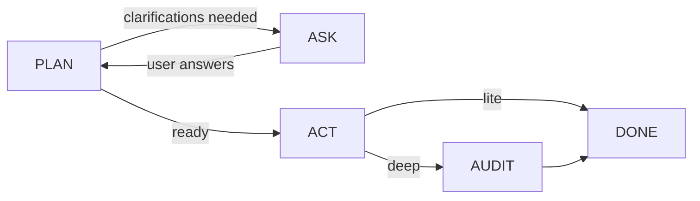
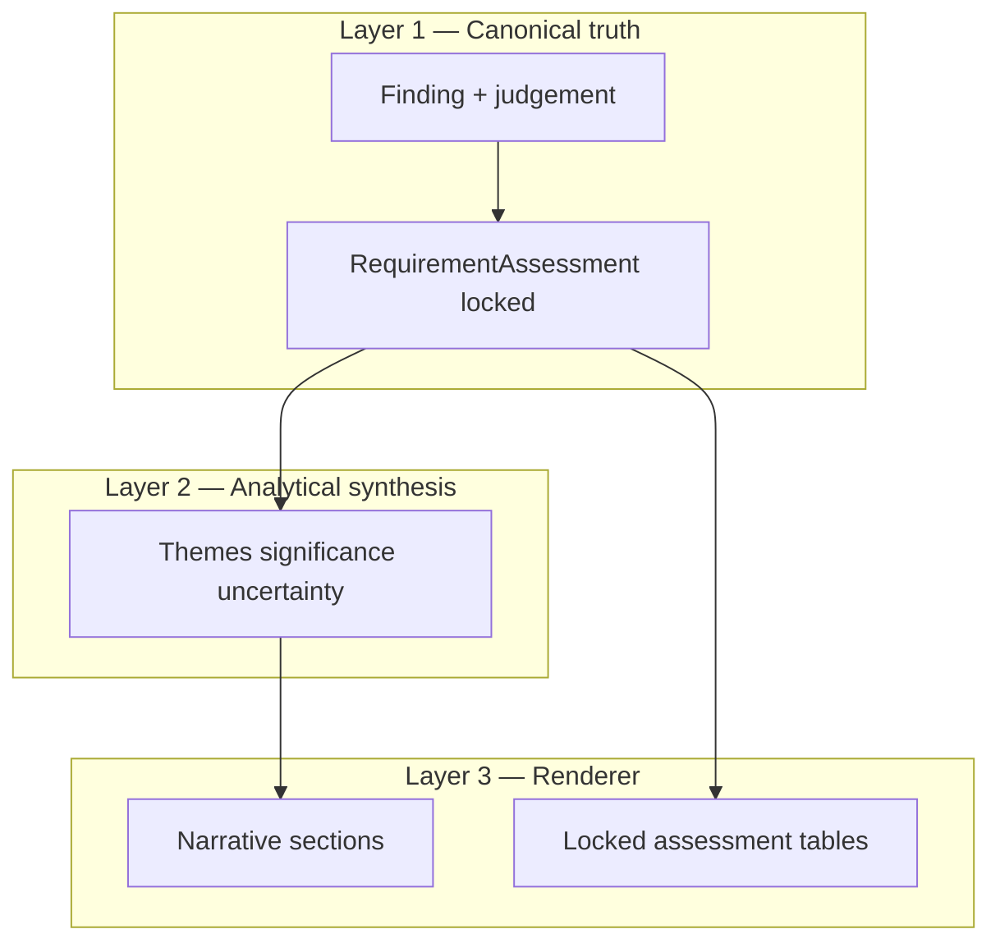

# Analysis Module — Architecture Redesign Reference

> **Purpose of this document.** A single, detailed reference for the ongoing architecture redesign of the analysis module — especially the **ACT phase**. Use it when making architectural decisions (Claude Code, Claude, or human review) so every phase, use case, constraint, and known failure mode is visible in one place.
>
> **Status:** Living document — updated as redesign decisions are made and shipped.
>
> **Base path:** `backend/src/modules/analysis/`
>
> **Related docs:**
> - [`OVERVIEW.md`](./OVERVIEW.md) — current product objective (short)
> - [`ANALYSIS-MODULE-DEEP-DIVE.md`](./ANALYSIS-MODULE-DEEP-DIVE.md) — line-by-line current implementation map
> - [`ART28-ATTEMPTS-CHAT-RETROSPECTIVE.md`](./ART28-ATTEMPTS-CHAT-RETROSPECTIVE.md) — what was tried and reverted on ACT quality
> - [`PIPELINE-ISSUES.md`](./PIPELINE-ISSUES.md) — NDA / non-GDPR failure cases
> - [`PLAN-ACT-WALKTHROUGH-ART28-AND-RISK.md`](./PLAN-ACT-WALKTHROUGH-ART28-AND-RISK.md) — live Art 28 run trace
> - [`CONTRIBUTING.md`](./CONTRIBUTING.md) — where new code belongs

---

## Table of contents

1. [Why we are redesigning](#1-why-we-are-redesigning)
2. [Product promise and use cases](#2-product-promise-and-use-cases)
3. [End-to-end request flow](#3-end-to-end-request-flow)
4. [PAC phase machine](#4-pac-phase-machine)
5. [Phase-by-phase reference](#5-phase-by-phase-reference)
6. [Skills system](#6-skills-system)
7. [ACT phase — current design](#7-act-phase--current-design)
8. [ACT phase — redesign direction](#8-act-phase--redesign-direction)
9. [Data model and state flow](#9-data-model-and-state-flow)
10. [Three-layer truth architecture](#10-three-layer-truth-architecture)
11. [Known problems by phase](#11-known-problems-by-phase)
12. [Hard constraints (non-negotiables)](#12-hard-constraints-non-negotiables)
13. [Success criteria](#13-success-criteria)
14. [Decision log template](#14-decision-log-template)
15. [File map for redesign work](#15-file-map-for-redesign-work)

---

## 1. Why we are redesigning

The analysis module works as a **PAC pipeline** (Plan → Act → optional Audit → Done) that turns an instruction + documents into a counsel-facing memo or table. The architecture is sound at the macro level — TypeScript owns phase transitions, skills own legal content, ACT runs a deterministic work-unit DAG.

**The problem is not the PAC shape.** The problem is that incremental fixes (especially in ACT) have produced plumbing that passes unit tests but still fails counsel review on real documents. The core failure:

> **Related legal text ≠ text that proves the exact proposition.**

Examples from real DPA runs (Mastercard / Cisco-style Art 28 reviews):

- Subject matter row cites DSR / security clauses instead of the clause that actually states subject matter
- Duration marked Strong based on termination / deletion-adjacent language
- Status says Present while rationale denies coverage ("does not set out…")
- Findings link to the correct requirement row but cite the wrong evidence
- Report synthesis repeats matrix dumps instead of counsel-quality interpretation

**Why AI-assisted patching won't fix this:**

1. Fixes applied at the wrong layer (GDPR hardcodes in generic ACT handlers) break general-purpose use (NDA, AI Act, ad-hoc clause review)
2. Identity / aggregation fixes improve linkage but not correctness ("linked ≠ correct")
3. Unit test fixtures are too narrow — green tests coexist with bad real-DPA output
4. Two disconnected execution paths (packages vs rules) create orphaned findings for non-GDPR docs

**Redesign focus:** Keep the PAC skeleton and three-layer truth model. Redesign ACT evidence grounding, requirement-to-finding linkage, and skill-to-ACT contracts so counsel-quality output is achievable without regime-specific code in shared handlers.

---

## 2. Product promise and use cases

### What the module must deliver

Counsel uploads one or more contracts, asks a question, and receives a **grounded legal answer** — not an LLM essay.

| Promise | Meaning |
|---------|---------|
| **Grounded statuses** | Status and quotes come from reviewed text (or clear annex/SOW pointers), not invention |
| **Counsel language** | User sees Strong / Present & adequate / Gap / Cannot determine — not internal enums |
| **Format fidelity** | Narrative vs tabular output matches what the user asked for |
| **Streaming** | Final report streams in outline order while sections generate in parallel |
| **Tolerable latency** | Few fat parallel model calls; no per-requirement LLM fan-out |

### Primary use cases

| # | Use case | Example user ask | Skills / path |
|---|----------|------------------|---------------|
| 1 | **GDPR Art 28 DPA compliance** | "Art 28 mandatory clauses — table" | `doc-types/dpa` + `regimes/data-protection/gdpr` → evidence packages |
| 2 | **Regime compliance memo** | GDPR rights matrix, lawful basis, transfers | Regime skills (GDPR, CCPA, UK IDTA, EU AI Act, HIPAA BAA) |
| 3 | **Doc-type structural review** | "Analyse this NDA / MSA / SaaS agreement" | `doc-types/nda`, `msa`, `vendor-agreement`, etc. → rules + expected clauses |
| 4 | **Risk flagging** | "Biggest risks for the customer" | `flag_risk` + doc-type + topic skills |
| 5 | **Playbook comparison** | Target doc vs reference playbook | Tier P: `check_against_rule` + playbook extract |
| 6 | **Q&A / extraction** | Short explain or extract asks | `explain_qa`, inventory packages |
| 7 | **Follow-up / presentation change** | "Show that as a table instead" | Re-PLAN with `follow-up-intent.ts` |

### What we are NOT building

- A replacement for counsel judgment
- An obligation inventor (missing annexes → Obtain/Confirm, not Amend-from-thin-air)
- A generic RAG chatbot over contracts
- A per-requirement LLM fan-out engine
- A critique-driven rewrite loop (retired)

---

## 3. End-to-end request flow

```text
Frontend (Analyze / InteractAnalyze)
  → POST analysis job (CREATE | RESUME_ASK)
  → jobQueue: type "analysis_pac"
  → entry/analysis-workflow.ts
  → PacController.run(state)
  → PLAN → (ASK?) → ACT → (AUDIT if deep) → DONE
  → persist + stream tokens to UI
```

| Layer | Path | Role |
|-------|------|------|
| HTTP | `api/controller.ts`, `api/route.ts`, `api/schema.ts` | Enqueue CREATE / RESUME_ASK |
| Job | `backend/src/services/jobs/handlers/analysis-handler.ts` | Runs PAC in worker |
| Entry | `entry/analysis-workflow.ts` | Seeds profile (lite/deep), conversation |
| Loop | `pac/controller.ts` | Owns phases; LLM never chooses next hop |
| Persist | `capabilities/persist/persist-analysis.ts` | Writes conversation on DONE |

### Lite vs deep

| Mode | Flow | When |
|------|------|------|
| **Lite** | `PLAN → ACT → DONE` | Default; fast counsel review |
| **Deep** | `PLAN → ACT → AUDIT → DONE` | Adds deterministic grounding verification pass |

**Critical:** Neither mode re-enters ACT. `CRITIQUE_PAUSED = true` — critique redo loops are retired. Deep ≠ retry loop.

---

## 4. PAC phase machine



| Phase | Purpose | LLM involvement | Output consumed by |
|-------|---------|-----------------|-------------------|
| **PLAN** | Understand ask, select skills, resolve packages, build ACT DAG + report outline | classify-intent, catalog/focus, optional outline refine | ACT |
| **ASK** | Pause for critical clarifications | None (reads plan clarifications) | PLAN (on resume) |
| **ACT** | Execute work-unit DAG; lock assessments; render report | extract, evaluate, synthesize, section writers | AUDIT or DONE |
| **AUDIT** | Deep grounding verification | Optional verifier for contradictions | DONE |
| **DONE** | Persist, release report | None | UI |

Source of truth: `pac/controller.ts`, `pac/transitions.ts`, `pac/policy.ts`.

---

## 5. Phase-by-phase reference

### 5.1 PLAN — "What should we do?"

**Goal:** Turn instruction + documents into a closed, executable plan: intent, skills, packages, ACT graph, report outline.

**Orchestrator:** `capabilities/plan/build-plan.ts`

#### PLAN pipeline (in order)

| Step | File(s) | What it does |
|------|---------|--------------|
| 1. Classify intent | `classify-intent.ts` | LLM → closed JSON: operation, scope, standard, outputForm, requirements, clarifications |
| 2. Heuristics / defaults | `intent-heuristics.ts`, `intent-sensible-defaults.ts` | Fix misclassification (e.g. "Analyse NDA" → risk_audit not summarize) |
| 3. Normalize requirements | `intent-requirement-normalize.ts` | Parse/expand requirements from raw LLM output |
| 4. Follow-up handling | `follow-up-intent.ts` | Presentation changes on subsequent turns |
| 5. Document roles | `resolve-document-roles.ts` | Target vs reference/playbook docs |
| 6. Skill selection | `skills/runtime/selection/resolve-skills.ts` | Active skills; doc-type floor from `docTypeHint` |
| 7. Instruction focus | `skills/runtime/focus/extract-instruction-focus.ts` | Map ask → packages, rules, matrix rows, risk categories |
| 8. Package resolution | `skills/runtime/graph/resolve-packages.ts` | PLAN requirements → authored evidence packages |
| 9. ACT graph build | `skills/runtime/graph/build-act-graph.ts` | Ordered `AnalysisWorkUnit[]` DAG |
| 10. Report spec | `resolve-report-spec.ts`, `derive-report-outline.ts` | Section outline, answer style, depth |
| 11. Optional refine | `refine-report-outline.ts` | LLM outline tweak (does not redesign graph) |
| 12. Inject authored reqs | `inject-authored-requirements.ts` | Skill-authored requirement injection |

#### PLAN outputs (written to `AnalysisState.plan`)

- `intent` — classified axes + requirements list
- `activeSkillIds`, `activeSkills` — hydrated skill configs
- `instructionFocus` — ruleIds, matrixRowIds, riskCategoryIds, requirementMappings
- `workUnits[]` — ACT DAG with dependencies
- `reportSpec` — outline sections, answerStyle, depth
- `packageResolution` — packages, leftovers, requirement paths
- `missingClarifications` — if any → ASK phase

#### PLAN use case example — Art 28 table ask

**User ask:**
> Perform a rigorous GDPR Article 28 compliance review… Present findings as a table.

**PLAN produces:**
- 6 requirements: `gdpr.article28.subject_matter`, `duration`, `nature_and_purpose`, etc.
- Skills: `_global`, `doc-types/dpa`, `regimes/data-protection/gdpr`
- 2 packages: `gdpr.art28.particulars`, `gdpr.art28.3.mandatory_clauses`
- 13 work units in ACT graph
- `outputForm=table`, `reportType=regime_compliance_memo`

See [`PLAN-ACT-WALKTHROUGH-ART28-AND-RISK.md`](./PLAN-ACT-WALKTHROUGH-ART28-AND-RISK.md) for full trace.

#### PLAN known issues

| Issue | Impact |
|-------|--------|
| Intent misclassification | "Analyse + Identify" → `extract` instead of structured review |
| Keyword triggers | "Identify" → extraction; "brief" → summary — wrong for NDA/commercial |
| `depth` in intent ≠ PAC deep mode | Confusing: intent `depth=deep` only shapes report, not AUDIT phase |
| Package-only resolution | Requirements without packages → `not_supported` even when rules exist |
| Risk category flooding | Focus LLM can over-select risk categories (partially fixed) |

---

### 5.2 ASK — "What do we need from the user?"

**Goal:** Pause the run when critical clarifications are required.

| File | Role |
|------|------|
| `capabilities/ask/ask-user.ts` | Sets `agent.openQuestions`, `stoppedReason=awaiting_user` |

**Trigger:** `plan.missingClarifications` or `clarificationRequest` from PLAN.

**Resume:** `entry/analysis-workflow.ts` `resumeAfterAsk` → re-enters at **PLAN** (not ACT).

**Use case:** User asks "Review this agreement" without specifying target doc when multiple are uploaded.

---

### 5.3 ACT — "Do the analysis" (redesign focus)

**Goal:** Execute the work-unit DAG; produce Findings → lock RequirementAssessments → render grounded report.

**Orchestrator:** `capabilities/act/execute-act-plan.ts`

See [Section 7](#7-act-phase--current-design) and [Section 8](#8-act-phase--redesign-direction) for full ACT detail.

---

### 5.4 AUDIT — "Verify grounding (deep only)"

**Goal:** Deterministic quote verification after ACT; optional LLM verification notes for contradictions.

| File | Role |
|------|------|
| `capabilities/audit/run-audit.ts` | Orchestrates deep pass |
| `capabilities/audit/ground-findings.ts` | Quote verification, sibling-bleed downgrade |

**What AUDIT does NOT do:**
- Rewrite locked findings
- Change assessment statuses
- Re-run evaluate_package
- Re-enter ACT

**Use case:** Deep mode on high-stakes DPA review where counsel wants extra confidence that quotes exist in source text.

---

### 5.5 REPORTING — "Tell the user" (final ACT tool)

Rendering is the **last ACT tool** (`render_output`), implemented under `capabilities/reporting/`.

| File | Role |
|------|------|
| `render-output.ts` | Ground → analytical synthesis → parallel sections → locked tables |
| `analytical-synthesis.ts` | One-shot interpretation over locked rows (no status change) |
| `synthesize-report.ts` | Section writers, streaming in outline order |
| `finalize-report-spec.ts` | Final outline before write |
| `unsupported-inference.ts` | Block gap language without locked gap rows |
| `limitations-report.ts` | Limitations / obtain list UX |

See [Section 10](#10-three-layer-truth-architecture) for the three-layer invariant.

---

### 5.6 CRITIQUE — retired

Code exists (`capabilities/critique/*`) but `CRITIQUE_PAUSED = true`. PAC `case "CRITIQUE"` logs retired and goes DONE.

**Do not design new features assuming critique redo.**

---

### 5.7 PERSIST — "Save the run"

| File | Role |
|------|------|
| `capabilities/persist/persist-analysis.ts` | Writes conversation / ledger on DONE |

---

## 6. Skills system

Skills are the **authored legal content layer**. Generic ACT handlers must not hard-code GDPR/NDA tokens — law lives here.

### Layout

```text
skills/
  _global/              # Always-on baseline
  doc-types/            # dpa, nda, msa, saas-agreement, vendor-agreement, …
  regimes/              # gdpr, ccpa-cpra, uk-gdpr-idta, eu-ai-act, hipaa-baa, …
  topics/               # vendor-risk, cybersecurity-and-incident-response
  jurisdictions/        # california, delaware, england-wales, ireland
  runtime/              # Engine (selection, focus, graph, catalog, lint)
  docs/                 # Authoring guides
```

### Skill axes

`global | doc-type | regime | jurisdiction | topic`

### What `skill.config.ts` contains

| Field | Purpose |
|-------|---------|
| `triggerPhrases` | Skill activation signals |
| `appliesToDocTypes` | Doc-type affinity |
| `clauseTypes` | Clause taxonomy mapping |
| `regimeRules[]` | ruleId, ruleText, checkType, findingCategory |
| `riskCategories[]` | Silence patterns, heuristics |
| `expectedClauses[]` | Doc-type structural checks |
| `rightsMatrixRows[]` | GDPR-style rights matrix |
| `evidencePackages[]` | **Authored analysis packages** (never assembled by similarity at runtime) |
| `relatedChecks[]` | Adjacent reviewer checks |
| `instructionFocusMap[]` | Phrase → rule/matrix/risk focus |
| `requirementEvidence` | Per-requirement **`hypothesis`** + **`evidenceHints`** |

### Skills runtime

| Subfolder | Responsibility |
|-----------|----------------|
| `catalog/` | Registry, manifest, SKILL.md loading |
| `selection/` | `select-skills.ts`, `resolve-skills.ts` |
| `focus/` | `extract-instruction-focus.ts`, `extract-explicit-scope.ts` |
| `graph/` | `resolve-packages.ts`, `build-act-graph.ts` |
| `lint/` | Config ↔ SKILL.md parity (`npm run lint:skills`) |

### Dependency rule

`skills/` must not import `capabilities/` (except documented exceptions).

### Example: GDPR Art 28 packages

In `skills/regimes/data-protection/gdpr/skill.config.ts`:

- `gdpr.art28.particulars` — subject matter, duration, nature/purpose, categories, controller obligations
- `gdpr.art28.3.mandatory_clauses` — lettered 28(3)(a)–(h) + 28(4)

Each requirement has authored `hypothesis` + `evidenceHints` consumed by ACT isolation/eval.

---

## 7. ACT phase — current design

### ACT tools (work units)

| Tool | File | Parallel-safe | Produces findings |
|------|------|---------------|-------------------|
| `classify_document` | `classify-document.ts` | No | No |
| `extract_clauses` | `extract-clauses.ts` | No | No |
| `extract_playbook_positions` | `extract-playbook-positions.ts` | No | No |
| `inventory_provisions` | `inventory-provisions.ts` | No | Optional |
| `extract_shared_evidence` | `extract-shared-evidence.ts` | Per package | No (bundle) |
| `evaluate_package` | `evaluate-package.ts` | **Yes** | **Yes** |
| `check_against_rule` | `check-against-rule.ts` | **Yes** | **Yes** |
| `evaluate_matrix_row` | `evaluate-matrix-row.ts` | **Yes** | **Yes** |
| `check_expected_clauses` | `check-expected-clauses.ts` | **Yes** | **Yes** |
| `flag_risk` | `flag-risk.ts` | **Yes** | **Yes** |
| `derive_risk` | `derive-risk.ts` | No | **Yes** |
| `aggregate_requirements` | `aggregate-requirements.ts` | No | Locks assessments |
| `render_output` | `reporting/render-output.ts` | No | Report |

Supporting modules:
- `isolate-requirement-evidence.ts` — per-requirement evidence packets
- `grouped-results-to-findings.ts` — LLM results → Findings + judgements
- `requirement-status-policy.ts` — deterministic judgement derivation
- `locate-evidence.ts` — heading/alias locate, truncated expansion

### Typical package ACT path

```text
classify_document
  → extract_clauses
  → per package:
       inventory_provisions? (if inventory kind)
       → extract_shared_evidence
       → evaluate_package (ONE LLM call per package, all requirements)
  → leftover rules/matrix → check_against_rule / evaluate_matrix_row
  → optional: flag_risk, web_assisted_reference, check_expected_clauses
  → aggregate_requirements        ← locks RequirementAssessment[]
  → derive_risk                   ← mechanical risk from compliance gaps
  → render_output                 ← ground → synthesis → sections → tables
```

### Evidence evaluation flow (current)

```text
extract_shared_evidence
  → SharedEvidenceBundle (items E1, E2, … with quotedText, truncated flags)
        ↓
isolate-requirement-evidence
  → hintsForRequirement (evidenceHints + hypothesis tokens)
  → candidateRefsByRequirement (non-exclusive scoring)
  → EvidencePacket: supporting / contextual / insufficient
        ↓
evaluate_package (ONE LLM call per package)
  → GroupedRequirementResult[] (axes: compliance, evidenceState, nli, …)
        ↓
grouped-results-to-findings
  → Finding[] with stamped requirementId + judgement
        ↓
(+ flag_risk, check_against_rule, derive_risk findings)
        ↓
aggregate-requirements
  → RequirementAssessment[] (locked: status, judgement, supportingFindingIds, summary)
        ↓
render_output
  → groundFindings → analytical synthesis → sections → locked assessmentTableMarkdown
```

### Two execution paths (critical architectural split)

```text
Path A — Packages (GDPR Art 28, inventory, etc.)
  PLAN requirement → resolve-packages → evidence package
  → extract_shared_evidence → evaluate_package
  → Finding.requirementId stamped → aggregation works

Path B — Rules (NDA, doc-type structural, leftover rules)
  PLAN requirement → requirementMappings → ruleId
  → check_against_rule
  → Finding.ruleId stamped (requirementId often missing)
  → aggregation must bridge via requirementMappings (workaround)
```

**Redesign must unify or clearly contract these paths.**

### Requirement identity (current)

`shared/requirement-identity.ts` solves PLAN id vs package-native id mismatch:

- PLAN: `gdpr.article28.duration`
- Package: `duration`, `art28_3_b_confidentiality`

Mechanisms:
- `STATIC_ALIAS_GROUPS` — PLAN ↔ package-native pairs
- `canonicalRequirementId()` — collapse aliases
- `getUmbrellaMembers()` — mandatory Art 28 clauses, combined categories rows
- `findingSupportsRequirement()` — aggregation matching
- `registerPackageRequirementIds()` — runtime registration

### Status model (current)

**Axes on `RequirementJudgement`:**

| Axis | Values | Rule |
|------|--------|------|
| `compliance` | present, partial, gap, insufficient_evidence, not_applicable | Does contract satisfy requirement? |
| `evidenceState` | direct, incorporated, truncated, unavailable, conflicting, not_found | What evidence we have |
| `referenceBinding` | binding, floating, none | Annex/schedule pointer strength |
| `nli` | entailed, contradicted, not_mentioned | **≠ compliance** |
| `draftingQuality` | clean, could_be_clearer, operational_weakness | Present/partial only |
| `materiality` | low, medium, high | Severity of residual issues |
| `recommendationKind` | none, obtain, confirm, clarify, amend | From axes |

**Display labels:** Strong · Present & adequate · Present, particulars in schedule · Minor drafting gap · Gap · Cannot determine · Not applicable

### What ACT fixes have landed (checkpoint)

| Fix | File | Effect |
|-----|------|--------|
| Requirement-scoped evidence packets | `isolate-requirement-evidence.ts` | supporting/contextual/insufficient per requirement |
| Canonical requirement identity | `requirement-identity.ts` | PLAN ↔ package-native alias matching |
| Compliance/risk graph split | `build-act-graph.ts` | No leftover flag_risk on package compliance path |
| Finding consolidation fix | `render-output.ts` | `consolidationKey` includes `finding.status` |
| Umbrella member resolution | `requirement-identity.ts` | `getUmbrellaMembers()` for Art 28 variants |
| Rule→requirement bridge | `aggregate-requirements.ts` | Uses `requirementMappings` for orphaned rule findings |

### What ACT still fails on (real documents)

| Failure | Example |
|---------|---------|
| Wrong clause cited as proof | DSR cited for subject matter |
| Strong + denying rationale | "Does not set out duration" + Present |
| Related ≠ proof | Security clause used for nature/purpose |
| Shallow synthesis | Repeated matrix dumps, not counsel voice |
| Path B orphan findings | NDA rules run but don't link to requirements at source |

---

## 8. ACT phase — redesign direction

This is the primary redesign target. Decisions here should be recorded in [Section 14](#14-decision-log-template).

### Design principles

1. **Law in skills, mechanics in ACT** — proof/noise signals authored in skill profiles; ACT handlers stay regime-agnostic
2. **Proposition-level grounding** — evidence must prove the specific legal proposition, not merely relate to the topic
3. **One requirement, one truth** — locked assessment per PLAN requirement; no orphan or duplicate rows
4. **Contradiction impossible** — rationale denying coverage cannot coexist with Present/Strong status
5. **Prove on real docs** — Mastercard/Cisco DPA, Randstad NDA — not only unit fixtures
6. **Keep grouped eval** — one LLM call per package, not per requirement

### What to keep (checkpoint)

- Requirement-scoped evidence packets (`EvidencePacket`)
- Canonical identity + umbrella linkage
- Compliance/risk graph split (aggregate → derive_risk → render)
- Finding consolidation fix
- Grouped `evaluate_package` (no per-requirement fan-out)
- Three-layer truth architecture

### What NOT to do (reverted — do not reintroduce)

- Hardcoded Art 28 FocusKinds / DSR-security demotion in generic `isolate-requirement-evidence.ts`
- GDPR-specific proof regexes in shared ACT handlers
- Per-requirement LLM fan-out
- PAC rewrite or critique redo loops
- RAG rebuild

### Proposed next shape

#### 8.1 Skill-scoped proof signals

Extend skill profiles with generic schema fields consumed by dumb ACT classifiers:

```typescript
// Proposed shape (not yet shipped — design target)
requirementEvidence: {
  hypothesis: string;           // exists today
  evidenceHints: string[];      // exists today
  proofSignals?: string[];      // text that PROVES the proposition
  noiseSignals?: string[];      // related but NOT proof (e.g. DSR for subject matter)
  relatedButNotProof?: string[]; // contextual only
}
```

**ACT handler contract:** `isolate-requirement-evidence.ts` scores candidates using skill-authored signals. No regime tokens in the handler itself.

#### 8.2 General contradiction guard

If rationale text denies coverage → cannot stay Present/Strong.

- Must be regime-agnostic (no Art 28 ID lists)
- Prior expanded guard was reverted because it was tied to GDPR hardcoding
- Re-implement as a general lexical/semantic check on rationale vs compliance axis

#### 8.3 Unified requirement→finding linkage

| Current | Target |
|---------|--------|
| Packages stamp `requirementId`; rules stamp `ruleId` only | All ACT tools stamp `requirementId` at source |
| Aggregation bridges via `requirementMappings` | PLAN work units carry `requirementId` into every tool |
| Two paths with different semantics | Single linkage contract |

#### 8.4 Evidence packet scoring redesign

| Current scoring | Problem | Target |
|-----------------|---------|--------|
| Keyword overlap + hint tokens | Related clauses score high | Proposition match: does text entail the hypothesis? |
| Non-exclusive candidate refs | Wrong refs included in supporting | Exclusive supporting set; contextual separate |
| Truncated extracts common | Heading-only → false Present | Truncated → insufficient_evidence unless expansion succeeds |

#### 8.5 Report synthesis (secondary ACT concern)

- Less duplicate matrix dump across sections
- More counsel-facing synthesis in outline/render prompts
- Analytical synthesis must interpret locked rows, not re-derive status
- Fix is prompt craft + outline structure — not another ACT loop

### ACT redesign open questions

| # | Question | Options | Decision |
|---|----------|---------|----------|
| 1 | Where do proofSignals live? | skill.config only vs separate profile files | TBD |
| 2 | How to score proposition match? | NLI axis only vs deterministic scorer + LLM | TBD |
| 3 | Should evaluate_package see packets or full bundle? | Packets only vs bundle + packet annotation | TBD |
| 4 | Contradiction guard: lexical vs LLM? | Regex patterns vs lightweight classifier | TBD |
| 5 | Unify paths now or bridge first? | Big-bang vs incremental bridge at aggregation | TBD |
| 6 | Handler layout: flat vs handlers/ subfolder? | CONTRIBUTING mentions handlers/ when adopted | TBD |

---

## 9. Data model and state flow

### Central state — `AnalysisState`

| Field | Set by | Consumed by |
|-------|--------|-------------|
| `intent` | PLAN classify | PLAN build, graph, render |
| `plan` | PLAN | ACT execute |
| `activeSkillIds`, `activeSkills` | PLAN | All ACT tools |
| `instructionFocus` | PLAN | Package resolution, graph |
| `findings[]` | ACT tools | Aggregate, render, audit |
| `sharedEvidence` | extract_shared_evidence | evaluate_package |
| `requirementAssessments[]` | aggregate_requirements | Render (locked truth) |
| `analyticalSynthesis` | reporting | Section writers |
| `reportSections[]`, `renderedOutput` | render_output | UI stream, audit |
| `auditReport` | AUDIT | Deep verification notes |

### Key types

| Type | File | Role |
|------|------|------|
| `AnalysisWorkUnit` | `models/analysis-plan.ts` | tool, input, dependsOn, requirementIds |
| `AnalysisToolName` | `models/analysis-plan.ts` | 14 registered tools |
| `InstructionFocus` | `models/analysis-plan.ts` | ruleIds, matrixRowIds, riskCategoryIds, requirementMappings |
| `EvidencePackage` | `models/evidence-package.ts` | id, requirementIds, requirementEvidence, kind |
| `SharedEvidenceBundle` | `models/evidence-package.ts` | Extracted items with quotedText |
| `Finding` | `models/finding.ts` | Status, evidence, judgement, requirementId |
| `RequirementAssessment` | `models/requirement-assessment.ts` | Locked truth per requirement |
| `RequirementJudgement` | `models/requirement-assessment.ts` | Multi-axis judgement |
| `IntentClassification` | `models/intent.ts` | operation, scope, standard, outputForm, requirements |

### State flow diagram

```mermaid
flowchart TB
  subgraph plan [PLAN]
    intent[intent + requirements]
    skills[activeSkills]
    graph[workUnits DAG]
    outline[reportSpec]
  end

  subgraph act [ACT]
    evidence[sharedEvidence]
    findings[findings]
    assessments[requirementAssessments]
    report[renderedOutput]
  end

  intent --> graph
  skills --> graph
  graph --> evidence
  evidence --> findings
  findings --> assessments
  assessments --> report
  outline --> report
```

---

## 10. Three-layer truth architecture

This invariant must survive the redesign.



| Layer | What it is | Must NOT do |
|-------|------------|-------------|
| **Canonical findings** | `Finding` + `RequirementAssessment` | Be reinvented by writer |
| **Analytical synthesis** | Themes, significance over locked rows | Change compliance / invent gaps |
| **Renderer** | Narrative or locked markdown table | Invent Status/Evidence/Finding cells |

**Audit rule:** If narrative says Present and table says Gap for the same requirement, architecture has failed.

---

## 11. Known problems by phase

### PLAN

| Problem | Severity | Status |
|---------|----------|--------|
| Intent misclassification for NDA/commercial | High | Partially fixed (heuristics) |
| Package-only resolution for extraction reqs | High | Open |
| Risk category over-selection | Medium | Largely fixed |
| `depth` intent vs PAC deep confusion | Low | Documented |

### ACT (primary)

| Problem | Severity | Status |
|---------|----------|--------|
| Related ≠ proof evidence grounding | **Critical** | Open — redesign target |
| Strong + denying rationale | **Critical** | Open — guard reverted |
| PLAN id vs package-native orphan/linkage | High | Mostly fixed |
| Two paths (package vs rule) no unified linkage | High | Partial bridge |
| Truncated extract false Present | Medium | Partial |
| Risk contaminating compliance | Medium | Largely fixed |

### REPORTING

| Problem | Severity | Status |
|---------|----------|--------|
| Shallow synthesis / matrix dump | Medium | Open |
| Renderer not doc-type-aware | Medium | Partially fixed |
| Narrative vs table disagreement | High | Fixed when using locked rows |
| `brief_summary` → GDPR article table for NDA | Medium | Partially fixed |

### AUDIT

| Problem | Severity | Status |
|---------|----------|--------|
| Cannot fix upstream corruption | N/A | By design — fix in ACT |

### Cross-cutting

| Problem | Severity | Status |
|---------|----------|--------|
| Unit tests ≠ real document quality | **Critical** | Need golden DPA fixtures |
| GDPR-first assumptions in non-GDPR paths | High | Open |
| Critique blocked delivery | Low | Critique retired |

---

## 12. Hard constraints (non-negotiables)

| Allowed | Not allowed |
|---------|-------------|
| Fix ACT evidence packets, identity, risk/compliance split | Rewrite PAC phase machine |
| Skill-authored hints, hypotheses, proofSignals | Mastra / new agent frameworks |
| Grouped `evaluate_package` | Per-requirement LLM fan-out |
| Deterministic scoring / guards | RAG rebuild |
| General-purpose (NDA, AI Act, ad-hoc) | GDPR hardcodes in shared ACT handlers |
| Deep = AUDIT grounding pass | Critique redo loops |
| Three-layer truth model | Writer inventing status in table mode |

Enforced by:
- `capabilities/act/__fixtures__/generic-handler-domain-lint.test.ts`
- `npm run lint:skills`
- `pac/transitions.ts` (`CRITIQUE_PAUSED`)

---

## 13. Success criteria

### Must pass (counsel quality)

- [ ] Art 28 DPA review (Mastercard/Cisco-style): each table row has **its own** correct status, evidence, and finding
- [ ] No row cites a related-but-wrong clause as proof
- [ ] No Strong/Present status with rationale denying coverage
- [ ] NDA structured review: all requirements assessed, not "not applicable" placeholders
- [ ] Narrative and table agree on every requirement
- [ ] Memo interprets locked rows — not a matrix dump

### Must pass (mechanical)

- [ ] `npm run lint:skills` clean
- [ ] `generic-handler-domain-lint.test.ts` clean
- [ ] Golden fixtures: `golden-cisco-dpa-art28-obligation.test.ts`
- [ ] Aggregation fixtures: `canonical-requirement-aggregation.test.ts`
- [ ] Evidence isolation fixtures: `isolate-requirement-evidence.test.ts`
- [ ] NDA render: `render-output.no-gdpr-for-nda.test.ts`

### Performance

- [ ] Art 28 lite run < ~2 minutes wall time
- [ ] Package evals run in parallel (default concurrency 8)
- [ ] Report streams in outline order

---

## 14. Decision log template

Record architectural decisions here as they are made.

### Decision template

```markdown
### DEC-NNN: [Short title]

**Date:** YYYY-MM-DD
**Status:** proposed | accepted | rejected | superseded
**Context:** What problem or question prompted this?
**Decision:** What we decided
**Alternatives considered:** What we rejected and why
**Consequences:** What changes, what stays the same
**Files affected:** List of paths
```

### Decisions

#### DEC-001: Keep PAC skeleton, redesign ACT internals

**Date:** 2026-08-28  
**Status:** accepted  
**Context:** Multiple ACT fix attempts improved plumbing but not counsel quality. Full PAC rewrite is out of scope.  
**Decision:** Retain PLAN → ACT → AUDIT → DONE. Redesign ACT evidence grounding and skill-to-ACT contracts.  
**Alternatives considered:** PAC rewrite (rejected — too much scope); per-requirement fan-out (rejected — latency)  
**Consequences:** All quality work targets ACT handlers + skill profiles, not phase machine  
**Files affected:** `capabilities/act/*`, `skills/*/skill.config.ts`, `shared/requirement-identity.ts`

#### DEC-002: Proof signals belong in skills, not ACT handlers

**Date:** 2026-08-28  
**Status:** accepted  
**Context:** Attempt E hardcoded Art 28 proof rules in `isolate-requirement-evidence.ts`. Made things worse and broke general-purpose use.  
**Decision:** Extend skill profiles with `proofSignals` / `noiseSignals` / `relatedButNotProof`. ACT classifiers consume them generically.  
**Alternatives considered:** Regime-specific ACT branches (rejected); RAG over legal corpus (rejected)  
**Consequences:** Skill authoring burden increases; ACT stays clean  
**Files affected:** `skills/*/skill.config.ts`, `isolate-requirement-evidence.ts`, `models/evidence-package.ts`

#### DEC-003: [Next decision]

**Date:**  
**Status:** proposed  
**Context:**  
**Decision:**  
**Alternatives considered:**  
**Consequences:**  
**Files affected:**  

---

## 15. File map for redesign work

### ACT — primary redesign targets

| File | Redesign relevance |
|------|-------------------|
| `capabilities/act/isolate-requirement-evidence.ts` | **Core** — packet scoring, proof vs noise |
| `capabilities/act/extract-shared-evidence.ts` | Extract quality, truncation handling |
| `capabilities/act/evaluate-package.ts` | Grouped eval, cite isolation |
| `capabilities/act/aggregate-requirements.ts` | Unified linkage, judgement locking |
| `capabilities/act/grouped-results-to-findings.ts` | Judgement stamping, contradiction guard |
| `capabilities/act/requirement-status-policy.ts` | Deterministic status derivation |
| `capabilities/act/check-against-rule.ts` | Stamp requirementId at source |
| `capabilities/act/execute-act-plan.ts` | Tool registration only |
| `prompts/evaluate-package.ts` | Eval prompt craft |

### Skills — authored content for redesign

| File | Redesign relevance |
|------|-------------------|
| `skills/regimes/data-protection/gdpr/skill.config.ts` | Art 28 proofSignals pilot |
| `skills/doc-types/nda/skill.config.ts` | Non-GDPR path validation |
| `skills/runtime/graph/build-act-graph.ts` | Graph shape, path unification |
| `skills/runtime/graph/resolve-packages.ts` | Package resolution |
| `skills/runtime/focus/extract-instruction-focus.ts` | Focus / risk flooding |

### Shared / models

| File | Redesign relevance |
|------|-------------------|
| `shared/requirement-identity.ts` | Canonical IDs, umbrella members |
| `shared/article-linkage.ts` | Sibling bleed prevention |
| `models/evidence-package.ts` | proofSignals schema |
| `models/requirement-assessment.ts` | Judgement axes |
| `models/finding.ts` | Finding shape, requirementId |

### Reporting (secondary)

| File | Redesign relevance |
|------|-------------------|
| `capabilities/reporting/render-output.ts` | Consolidation, doc-type dispatch |
| `capabilities/reporting/analytical-synthesis.ts` | Synthesis quality |
| `prompts/analytical-synthesis.ts` | Prompt craft |
| `prompts/synthesis.ts` | Section writer prompts |

### Test fidelity gate

| Fixture | What it guards |
|---------|----------------|
| `skills/__fixtures__/golden-cisco-dpa-art28-obligation.test.ts` | Real DPA obligation quality |
| `capabilities/act/__fixtures__/canonical-requirement-aggregation.test.ts` | PLAN ↔ package identity |
| `capabilities/act/__fixtures__/isolate-requirement-evidence.test.ts` | Packet roles |
| `capabilities/act/__fixtures__/generic-handler-domain-lint.test.ts` | No regime tokens in ACT |
| `capabilities/act/__fixtures__/render-output.no-gdpr-for-nda.test.ts` | NDA render path |
| `skills/__fixtures__/render-output-upgrade.test.ts` | Consolidation + umbrella |

Run:
```bash
npm run lint:skills
node --test backend/src/modules/analysis/capabilities/act/__fixtures__/*.test.ts
node --test backend/src/modules/analysis/skills/__fixtures__/golden-cisco-dpa-art28-obligation.test.ts
```

---

## Appendix A — Art 28 use case walkthrough (condensed)

**Ask:** GDPR Art 28 compliance review, table output.

**PLAN (12s):**
1. Classify → 6 requirements, `compliance_check`, `outputForm=table`
2. Skills → `_global`, `doc-types/dpa`, `regimes/data-protection/gdpr`
3. Focus → 2 packages + Art 28 rules
4. Graph → 13 work units

**ACT (92s):**
1. `extract_clauses` → 39 clauses
2. `extract_shared_evidence` ×2 → 8 + 12 items (many truncated)
3. `evaluate_package` ×2 (parallel) + `check_against_rule` ×3
4. `aggregate_requirements` → 8 locked assessments
5. `render_output` → analytical synthesis + 5 sections + locked table

**Where it breaks:** Steps 2–4 — wrong evidence assigned to requirements; assessments lock with wrong cites; renderer faithfully repeats corrupted truth.

Full trace: [`PLAN-ACT-WALKTHROUGH-ART28-AND-RISK.md`](./PLAN-ACT-WALKTHROUGH-ART28-AND-RISK.md)

---

## Appendix B — NDA use case walkthrough (condensed)

**Ask:** Analyse confidentiality obligations — scope, exceptions, survival, return/destruction, mutuality.

**PLAN failures (historical):**
- Classified as `extract` not structured review
- 6 requirements, no packages → all `not_supported`
- Outline collapsed to Scope + Conclusion only

**ACT failures (historical):**
- Rules ran correctly (`nda.ci_definition`, etc.)
- Findings had `ruleId` but no `requirementId`
- Aggregation found no linked findings → "not applicable" placeholders
- Risk finding (5-year survival) contradicted placeholder assessments

**Fixes landed:** intent heuristics upgrade, aggregation bridge via requirementMappings, insufficient_evidence not not_covered, NDA render fallback.

**Still open:** survival-period rule in NDA skill catalog; requirementId stamping at source in check_against_rule.

Full cases: [`PIPELINE-ISSUES.md`](./PIPELINE-ISSUES.md)

---

*Last updated: 2026-08-28*
