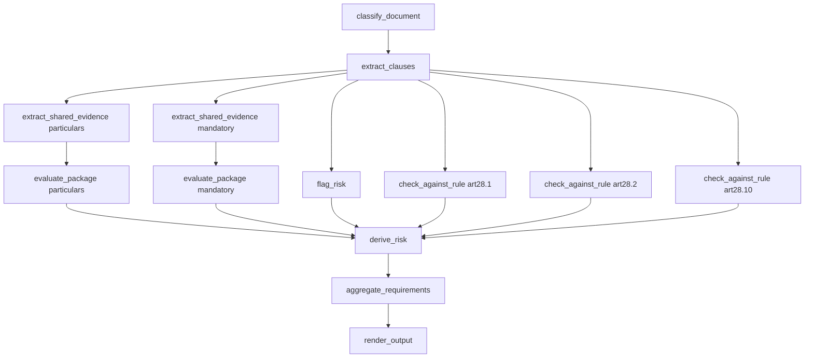
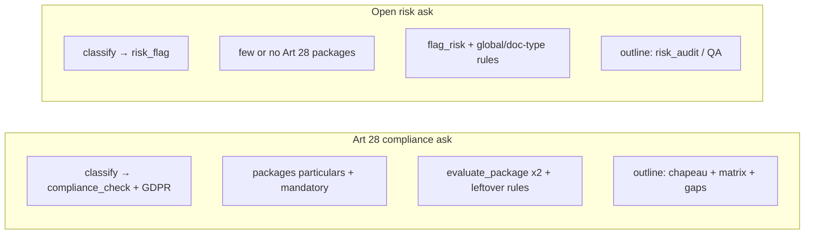

# PLAN → ACT walkthrough — Art 28 prompt + general risk asks

> **Purpose.** Architecture analysis of what the system actually does when a user asks a specific GDPR Article 28 review, and how that differs from open-ended risk questions. Built from live PAC terminal logs (job `7d8a5104-…`, ~06:12–06:14 IST) plus the pasted memo/table output.
>
> **Companion.** [`ANALYSIS-MODULE-DEEP-DIVE.md`](./ANALYSIS-MODULE-DEEP-DIVE.md) (module map), [`OVERVIEW.md`](./OVERVIEW.md), [`PIPELINE-ISSUES.md`](./PIPELINE-ISSUES.md).
>
> **Base path.** `backend/src/modules/analysis/` unless noted.

---

## 0. The user ask (worked example)

```text
Perform a rigorous GDPR Article 28 compliance review of this Data Processing Agreement.
Verify: subject matter, duration, nature and purpose of processing, categories of data
and data subjects, obligations and rights of the controller, and whether all mandatory
Article 28(3) clauses are present and adequate. Present findings as a table.
```

From the terminal:

```text
[Analysis PAC] job create … docs=1 … thinkingMode=lite
[Analysis PAC] analysisProfile thinkingMode=lite maxTurns=1 enableDeepCritique=false …
[Analysis PAC] ▶ PLAN …
```

Important mismatch to keep in mind throughout this run:

| Knob | Value on this run | Meaning |
|------|-------------------|---------|
| UI / profile `thinkingMode` | **lite** | Lite PAC: `PLAN → ACT → DONE` (no AUDIT phase) |
| Classified intent `depth` | **deep** | Only shapes report sections / token ceilings — **not** the PAC loop |
| `answerStyle` / `outputForm` | **tabular** / **table** | Locked tables expected in the memo |
| Doc | DPA (`docTypeHint=dpa`), ~18 820 chars | Segmented into 34 candidate sections |

So “deep” in the classify log does **not** mean deep PAC. Critique is paused; lite never enters AUDIT.

---

## 1. End-to-end timeline (from your terminal)

| Clock | Phase / event | What happened |
|-------|---------------|---------------|
| 06:12:42.802 | PLAN start | `classify-intent ▶ LLM` |
| 06:12:47.949 | PLAN INSPECT — classify | 6 requirements, `compliance_check`, `regime_compliance_memo`, `outputForm=table` |
| 06:12:47.988 | Skill selection | `_global`, `doc-types/dpa`, `regimes/data-protection/gdpr` (~13 ms) |
| 06:12:54.525 | Catalog / focus LLM | Maps instruction → packages/rules (~6.5 s) |
| 06:12:54.527 | Package resolution | 2 packages + leftover rules |
| 06:12:54.538 | ACT graph built | **13 work units** |
| 06:12:54.733 | PLAN → ACT | ~12 s PLAN |
| 06:12:54.741 | `classify_document` | Instant, 0 findings |
| 06:12:59.848 | `extract_clauses` | 39 clauses, 18 found / 22 notFound, ~5 s LLM |
| 06:12:59.850 | `extract_shared_evidence` ×2 | particulars: 8 items (6 truncated); mandatory: 12 items (9 truncated) |
| 06:13:04.901 | `flag_risk` | 3 risk findings (~5 s) |
| 06:13:04–06:13:58 | Parallel batch | 2× `evaluate_package` (+ expansion retries) + 3× `check_against_rule` |
| 06:13:58.907 | `derive_risk` | 1 finding |
| 06:13:58.913 | `aggregate_requirements` | Locks **8 assessments**, all `conditional` |
| 06:13:58–06:14:26 | `render_output` | Analytical synthesis + 5 section writers |
| 06:14:26.402 | DONE | `reason=green`, findings=37, ~104 s wall |

---

## 2. PLAN phase — file by file

```text
PacController (PLAN)
  → classifyIntent          capabilities/plan/classify-intent.ts
  → buildPlan               capabilities/plan/build-plan.ts
       → resolveDocumentRoles
       → applySensibleDefaults / heuristics
       → resolveSkills
       → extractInstructionFocus (+ catalog LLM)
       → resolve-packages
       → build-act-graph
       → merge report sections + deriveReportOutline
  → nextPhaseAfterPlan → ACT
```

### 2.1 `classify-intent.ts` — instruction → closed JSON

**LLM call:** `STRUCTURAL_JSON_LITE` (~5.1 s).

The model does **not** get to invent free-form pipeline steps. It must fill a fixed schema roughly:

| Field | This run | How the system “understands” it |
|-------|----------|----------------------------------|
| `operation` | `compliance_check` | Run compliance packages / rules, not free “chat about the contract” |
| `reportType` | `regime_compliance_memo` | Memo shaped for a regime (GDPR), not `risk_audit` or bare QA |
| `depth` | `deep` | Prefer fuller section list / missing_materials; metadata only for PAC |
| `scope` | `whole_document` | Do not limit to one clause |
| `outputForm` | `table` | Tabular craft + locked assessment tables |
| `standard` | `regime_pack:regimes/data-protection/gdpr` | Load GDPR skill |
| `standardConcept` | `GDPR Article 28` | Focus Art 28 |
| `docTypeHint` | `dpa` | Force-include `doc-types/dpa` |
| `requirements[]` | 6 adequacy/coverage items | Become PLAN requirement ids |

**What the LLM produced as requirements (from PLAN INSPECT):**

1. `gdpr.article28.subject_matter` — adequacy  
2. `gdpr.article28.duration` — adequacy  
3. `gdpr.article28.nature_and_purpose` — adequacy  
4. `gdpr.article28.categories_of_data_and_subjects` — adequacy  
5. `gdpr.article28.controller_obligations_and_rights` — adequacy  
6. `gdpr.article28.mandatory_clauses_completeness` — coverage  

So the prose “Verify: subject matter, duration, …” is **parsed into discrete requirement ids**. That list drives package resolution and outline tags later.

Heuristics (`intent-heuristics.ts`, `intent-sensible-defaults.ts`) can upgrade/normalize weak classifications. For this prompt the LLM already hit the right operation/standard with high confidence (op=0.98).

### 2.2 Skill selection — `resolve-skills.ts`

Terminal:

```text
PLAN skill-selection ms=13 skills=_global,doc-types/dpa,regimes/data-protection/gdpr
PLAN doc-type floor docType=dpa
```

| Skill | Why |
|-------|-----|
| `_global` | Always-on commercial baseline |
| `doc-types/dpa` | Doc-type floor from `docTypeHint=dpa` |
| `regimes/data-protection/gdpr` | `standard` / Art 28 concept |

**No LLM here** for the floor — deterministic. Wrong skills → blank or wrong packages later.

### 2.3 Catalog / focus — `extract-instruction-focus.ts` + catalog LLM

Terminal:

```text
catalog prefilter full=135 strong=true …
PLAN catalog/focus ms=6535 reqs=6
```

Second PLAN LLM (~6.5 s) picks **capabilities** from the GDPR catalog:

- **Required packages:** `gdpr.art28.particulars`, `gdpr.art28.3.mandatory_clauses` (`package/catalog_llm`)
- **Required rules:** `gdpr.art28.1` … `gdpr.art28.10` (`rule/explicit_number` — “Article 28” in the ask)
- **Supporting risk cats:** many Art 28.* gaps + phrase_map risks

So “Article 28” in the instruction is both:

1. Parsed into 6 user-facing requirements, and  
2. Expanded into the authored rule/package set in `gdpr/skill.config.ts`.

### 2.4 Package resolution — `resolve-packages.ts`

Terminal:

```text
PLAN package resolution packages=[2]
requirementToPackageId={
  "gdpr.article28.subject_matter":"dpa.structural_review",   // interim / alias path
  …
  "gdpr.article28.mandatory_clauses_completeness":"gdpr.art28.3.mandatory_clauses",
  "subject_matter":"gdpr.art28.particulars", …              // package-native ids
}
leftoverRuleIds=[3]
```

Coverage check then shows the **effective** mapping:

```text
[OK] gdpr.article28.subject_matter → gdpr.art28.particulars
…
[OK] gdpr.article28.mandatory_clauses_completeness → gdpr.art28.3.mandatory_clauses
```

| Package | Role |
|---------|------|
| `gdpr.art28.particulars` | Chapeau particulars (subject matter, duration, nature/purpose, categories, controller rights) |
| `gdpr.art28.3.mandatory_clauses` | Art 28(3)(a)–(h) + flow-down |
| Leftover rules (3) | `gdpr.art28.1`, `.2`, `.10` → separate `check_against_rule` units |

`dpa.structural_review` may appear in the raw map but is suppressed when a peer evaluation package is selected (`suppressWhenPeerEvaluation` on the DPA skill). Live graph still shows **2** eval packages, not structural.

### 2.5 Report skeleton — why headings never “surprise” you

This is the answer to: *“We call an LLM every time — why is the structure always the same?”*

**Because the section list is mostly deterministic.**

1. Packages declare `report.sections` / `outlineExtras` in `gdpr/skill.config.ts`.  
2. `resolve-report-spec.ts` → `mergeAuthoredReportSections` unions those sections.  
3. `derive-report-outline.ts` builds the outline **in TypeScript** from:
   - opening (`executive_summary` / `scope`)
   - **package `outlineExtras`** (e.g. “Processing particulars (Art 28(3) chapeau)”)
   - remaining requirements → “Requirements matrix” / key findings
   - static tail from the section list: `material_gaps`, `recommendations`, `missing_materials`, `conclusion`

Your PLAN INSPECT:

```text
reportType     regime_compliance_memo
depth          deep
sections       executive_summary → requirements_matrix → material_gaps → missing_materials → conclusion
outlineItems   6
outlineAnalysis 2
```

That is why every Art 28 tabular run looks like:

```text
## Executive Summary
## Processing particulars (Art 28(3) chapeau)   ← outlineExtra from GDPR package
## Requirements matrix                          ← leftover / matrix section
## Material gaps
## Recommendations                              ← may appear from merge / refine
## Missing materials                            ← depth deep
## Conclusion
```

**What the LLM is allowed to vary**

| Layer | Varies run to run? | What varies |
|-------|--------------------|-------------|
| Section **headings** / order | Almost never | Authored + deterministic outline |
| Table **Status** cells | Should not (locked) | From `RequirementAssessment` |
| Table Evidence / Finding prose | Yes | Writer LLM, but should cite locked rows |
| Executive Summary wording | Yes | Section LLM |
| Which packages run | Stable for same ask | Catalog + resolution |
| Exact quotes / status labels | Yes (eval LLM) | But isolation/policy constrain them |

So you should **expect the same skeleton** for this prompt. Random “creative memo shapes” would be a bug relative to this architecture — counsel wants a stable checklist-shaped deliverable. Variance belongs in **judgements and quotes**, not in inventing new top-level headings every run.

Optional `refine-report-outline.ts` can tweak headings slightly; it does not redesign the regime memo from scratch.

### 2.6 ACT graph — `build-act-graph.ts`

Terminal:

```text
workUnits 13
classify_document → extract_clauses → extract_shared_evidence x2 → evaluate_package x2
→ flag_risk → check_against_rule x3 → derive_risk → aggregate_requirements → render_output
```



**Why the graph is “always the same” for this ask:**  
Same skills + same Art 28 packages + same leftover rules ⇒ same authored graph shape. The LLM does **not** invent work-unit topology. `build-act-graph.ts` compiles packages into units.

Variance inside the graph = which evidence items, which LLM eval JSON, which findings — not whether `evaluate_package` exists.

---

## 3. ACT phase — file by file (tied to your logs)

### 3.1 Batch 0 — `classify_document`

```text
ACT ✓ classify_document ms=0 findings=0
```

Confirms / stamps doc type. Cheap.

**File:** `capabilities/act/classify-document.ts`

### 3.2 Batch 1 — `extract_clauses`

```text
neededTypes=40 found=18 referencedElsewhere=0 notFound=22 clauses=39 docChars=18820
```

LLM extracts typed clauses from segmented text.

**What the system understands:** “Here are 39 clause-ish spans we can later bind into packages.”  
**Risk already visible:** 22 types notFound; many later “Cannot determine / Obtain annex” stories start here.

**Files:** `extract-clauses.ts`, `locate-evidence.ts`, `segmentation/segment-document.ts`

### 3.3 Batch 2 — `extract_shared_evidence` ×2

```text
particulars: items=8 chars=12957 truncated=6
mandatory:   items=12 chars=19701 truncated=9
```

Package-specific evidence bundles (E-refs). **6/8 and 9/12 truncated** means the eval LLM often never sees full clauses → policy should prefer Obtain / insufficient, not Amend — but writers still over-use “Minor drafting gap” when aggregation collapses to `conditional`.

**Files:** `extract-shared-evidence.ts`, package `extractionTargets` / `clauseTypes` in `gdpr/skill.config.ts`

### 3.4 Batch 2 — `flag_risk`

```text
findings=3  (e.g. audit limited to third-party reports; deletion/return choice issues)
```

Supporting risk cats fire. Can stamp high-severity risks that later pollute assessments if linkage is loose.

**File:** `flag-risk.ts`

### 3.5 Batch 3 — parallel eval + leftover rules

```text
evaluate_package particulars   requirements≈11 then expansion retry≈3
evaluate_package mandatory     requirements≈10 then expansion retry≈8
check_against_rule art28.1 / .2 / .10
```

Each `evaluate_package`:

1. `isolate-requirement-evidence.ts` — candidates per requirement  
2. Prompt `prompts/evaluate-package.ts` — axes per requirement  
3. LLM JSON  
4. Often **expansion=true** second pass when truncated / thin cites  
5. `grouped-results-to-findings.ts` — Findings + judgements  

Your run: ~25 findings from the two package evals alone.

Leftover `check_against_rule` units evaluate Art 28(1)/(2)/(10) text against authored rule briefs (extra LLM calls).

### 3.6 Batch 4–5 — `derive_risk` → `aggregate_requirements`

```text
assessments 8   conditional=8
```

Every locked assessment is **`conditional`** (display → **Minor drafting gap**).

Worse: several PLAN requirements share **nearly identical summaries** in the inspect dump:

```text
[X] gdpr.article28.subject_matter  … lacks complete processing particulars…
[X] gdpr.article28.duration        … same summary …
[X] gdpr.article28.nature_and_purpose …
…
```

That is the smoking gun behind your pasted table: **aggregation / linkage collapsed distinct rows onto the same supporting findings** (or shared gap claim), so the renderer correctly printed “one locked status” — but the locked status was already homogenized.

Also notice package-native leftovers still appear as separate assessments:

```text
[X] data_categories
[X] art28_3_h_audit
```

So you get **8** assessments for **6** PLAN requirements — extras from package-native ids / risks.

**Files:** `aggregate-requirements.ts`, `requirement-status-policy.ts`, `shared/article-linkage.ts`

### 3.7 Batch 6 — `render_output`

```text
analytical_synthesis ms≈6942 rows=8
synthesis … sections=5 … answerStyle=tabular
render synthesis ms≈27s assessments=8 schemaId=memo
```

Order:

1. `groundFindings`  
2. Analytical synthesis (1 JSON LLM) — interpret only  
3. One REFINEMENT LLM **per outline section** (parallel)  
4. `enforceAnswerStyleLayout` — strip invented tables; inject locked `assessmentTableMarkdown`

**Why the memo still looks “all Minor drafting gap”:**  
Section writers are instructed to treat locked statuses as given. If all 8 assessments are `conditional`, every Status cell becomes **Minor drafting gap**. The writer may also still emit wrong evidence quotes if grounding/isolation failed earlier — your paste shows the **same 3.7.1 / SCC transfer fragment** reused across subject matter, duration, categories, etc. That is classic **sibling quote bleed** (or one shared supporting finding attached to many assessments), not “creative variance.”

Truncation note from an earlier run:

```text
synthesis llm … truncated=true … [Report ended at the length limit for deep depth…]
```

Depth=deep raises ambition; lite profile still caps section tokens → mid-sentence cutoffs.

---

## 4. Mapping your pasted output → pipeline faults

| Symptom in memo | What the logs / architecture say |
|-----------------|----------------------------------|
| Same headings every Art 28 run | Deterministic outline from GDPR package extras + `regime_compliance_memo` |
| Almost every row **Minor drafting gap** | All 8 assessments locked `conditional` |
| Same Evidence quote (3.7.1 / transfers) on many rows | Shared / wrong supporting findings; isolation or aggregation bleed |
| Conclusion shows some **Strong** rows (confidentiality, security, subprocessors, deletion) | Writer/synthesis still free to emphasize present findings that didn’t become separate clean assessments — or mixed findings not cleanly projected per requirement |
| “Obtain annex / Confirm schedule” everywhere | Many truncated extracts (`truncated=6/9`) + annex language; policy leans Obtain, but display still “Minor drafting gap” when status is conditional |
| Report cut mid-sentence | Section token ceiling / truncated synthesis |

**Correct mental model:**  
Variance you want = different **locked** statuses and **per-row** quotes.  
Variance you should **not** expect = different top-level section menus for the same Art 28 compliance ask.

---

## 5. Why calling the LLM does not redesign the graph or the memo

| Decision | Owner | LLM role |
|----------|-------|----------|
| PAC phases | `pac/transitions.ts` | None |
| Skills | Deterministic floor + selection | Optional assist |
| Packages / work units | Authored config + `build-act-graph` | Catalog ranking assist |
| Report section ids | Package `report` + `deriveReportOutline` | Optional refine |
| Per-requirement hypothesis | Skill `requirementEvidence` | Eval only |
| Status axes | Eval LLM → judgement policy → aggregate | Constrained JSON |
| Table Status cell | `displayRequirementStatus(locked)` | Should not invent |
| Section prose | Section LLM | Must follow locked labels |

So: **yes**, we call LLMs many times — but mostly as **fillers inside a fixed machine**, not as freeform architects. That is intentional for counsel-facing compliance checklists. If every run invented a new outline, tables would be incomparable and regressions untestable.

If product wants more structural diversity, that must be an **explicit** PLAN choice (different `reportType` / outline extras / user “narrative memo” vs “table”), not random temperature on the same `regime_compliance_memo`.

---

## 6. General analysis asks — different PLAN, different graph

Examples:

- “What are the most important weaknesses in this contract?”  
- “What are the biggest risks for the customer?”  
- “Find anything unusual or concerning…”  
- “What clauses should I pay the most attention to?”  
- “Identify provisions that could create unexpected obligations.”  
- “What are the most one-sided provisions?”  
- “What could become a problem operationally?”

### 6.1 How classify usually treats them

Heuristics (`intent-heuristics.ts` `heuristicClassify`):

```text
risk | flag | liability | indemnit | uncapped  →  operation=risk_flag, reportType=risk_audit
```

LLM classify typically agrees: **risk_flag** / **explain_qa**, not **compliance_check**, and usually **no** `regime_pack:gdpr` unless the user mentions GDPR/Art 28.

| Axis | Art 28 ask | General risk ask |
|------|------------|------------------|
| `operation` | `compliance_check` | `risk_flag` (or `explain_qa`) |
| `standard` | GDPR regime pack | often `none` / commercial |
| `reportType` | `regime_compliance_memo` | `risk_audit` or `qa_answer` |
| Requirements | Explicit Art 28 checklist | Broader / fewer / LLM-invented themes |
| Packages | Art 28 particulars + mandatory | Often **no** GDPR packages; `_global` + doc-type + flag_risk / check_expected_clauses |
| Outline | Processing particulars + matrix | Risk summary / key findings / qualifications — **not** Art 28 chapeau |

### 6.2 Typical ACT graph for open risk asks

More like:

```text
classify_document → extract_clauses
  → flag_risk (heavy)
  → check_expected_clauses / check_against_rule (doc-type + _global rules)
  → derive_risk
  → aggregate_requirements (if requirements exist)
  → render_output
```

Often **zero** `evaluate_package` Art 28 units. Findings are risk-shaped (`kind=risk`), not Art 28 lettered adequacy rows.

### 6.3 What “good” looks like for these asks

- Structure: executive / key risks / one-sided clauses / operational concerns / recommendations — driven by `risk_audit` sections, not GDPR outlineExtras.  
- Content: severity-ranked risks with **distinct** quotes.  
- Failure mode (historical): still falling into GDPR brief_summary / empty matrix when doc-type is DPA and heuristics misfire — see `PIPELINE-ISSUES.md`.

### 6.4 Same “why structure is fixed” answer

Even for risk asks, headings come from **reportType + depth + skill report blocks**, not from the model freestyling a new memo genre each time. The LLM fills sections; TypeScript chooses which sections exist.

---

## 7. Side-by-side: Art 28 vs “biggest risks”



| Step | Art 28 prompt | “Biggest risks / one-sided / unusual” |
|------|---------------|----------------------------------------|
| Classify | High-confidence compliance + 6 reqs | risk_flag / explain_qa; soft requirements |
| Skills | `_global` + DPA + **GDPR** | `_global` + doc-type; GDPR only if mentioned |
| Graph | 2 grouped evals + Art 28 leftover rules | Risk-heavy; maybe no package eval |
| Assessments | One row per particular / clause family | Theme risks, not Art 28(3)(a)–(h) grid |
| User expectation | Checklist fidelity | Prioritized narrative of danger |

---

## 8. How to read the next terminal dump (checklist)

When you paste PLAN INSPECT + ACT INSPECT after a run:

1. **Classify** — operation / standard / requirements count. Wrong here → everything downstream wrong.  
2. **Skills** — is GDPR present only when asked?  
3. **Packages** — `[OK] requirement → package` lines.  
4. **Graph** — count of `evaluate_package`; leftover rules.  
5. **Shared evidence** — `truncated=N` high? Expect Obtain-heavy outcomes.  
6. **Assessments** — if many rows share one summary / all `conditional`, fidelity failed **before** the writer.  
7. **Render** — `answerStyle`, section count, `truncated=` on synthesis.  
8. **Memo** — Status cells must match assessment inspect; Evidence quotes must differ per row.

---

## 9. Takeaways for architecture review

1. **PLAN turns natural language into a closed intent + requirement list + skill/package set + deterministic outline + fixed ACT DAG.**  
2. **LLMs fill slots inside that machine** (classify JSON, catalog picks, clause extract, package eval axes, section prose). They do not redesign the machine each run.  
3. **Same Art 28 ask ⇒ same graph shape and same section menu is expected.** Different quotes/statuses are expected; different headings are not.  
4. Your live run’s real failure is **not** “LLM always writes the same essay structure.” It is **locked assessments all `conditional` with shared summaries + quote bleed**, then a faithful renderer repeating that law into every table.  
5. **General risk asks should leave the Art 28 package path** (different operation / reportType / graph). If they still produce Processing particulars / Art 28 matrices, classify or skill selection misfired.  
6. **`thinkingMode=lite` + `depth=deep`** means “lite PAC, ambitious memo” — easy to misread in logs.

---

## 10. Suggested next probes (when you continue the fidelity work)

- Dump `requirementAssessments` JSON for one run: confirm whether each row has **distinct** `supportingFindingIds` and quotes.  
- Inspect `sharedEvidence` items for particulars: are duration/controller quotes present and non-truncated?  
- Compare two Art 28 runs: outline headings identical? Assessment `compliance` axes different?  
- Run “What are the biggest risks for the customer?” on the **same DPA** and confirm PLAN INSPECT shows `risk_flag` / no Art 28 packages.

That contrast is the cleanest proof that classify + package resolution — not the section writer — choose the product shape.
