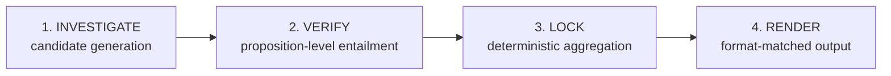

# ACT + PLAN Redesign — Open Research Findings

> **Purpose:** Response to an open research request: (1) is PAC the wrong
> architecture for this problem, (2) how should ACT be rebuilt from scratch
> (not patched), (3) how should PLAN generalize beyond compliance-checklist
> reasoning to match `ANALYSIS_FEATURE_VISION.md`. Written after reading
> `ANALYSIS_FEATURE_VISION.md`, `ACT_PHASE_REDESIGN_RESEARCH_BRIEF.md`
> (`ANALYSIS_ALL TRIED_SENARIOS_TO_FIX_ACT.md`), and the architecture
> reference (`CURSOR CURRENT SYSTEM STAGE AND ALL THE TRY.md`). No source
> code was read for this pass — see §7 for why, and when that changes.

---

## 0. Headline answer to the fundamental question

**PAC is not the mistake. The mistake is what's living inside ACT, and PLAN's scope is too narrow — not its shape.**

Every failed attempt in the tried-scenarios document shares one root cause,
independently confirmed twice: the system scores evidence by *topical
relatedness* and then treats "related" as "proven." That is a retrieval
problem and a missing-primitive problem, not a control-flow problem. Nothing
about Plan → Act → (Audit) → Done caused the Cisco DPA to cite DSR language
for subject matter. A LangGraph rewrite, a full agentic rebuild, or a
different phase machine would reproduce the exact same bug, because none of
those things touch evidence-to-proposition matching. This is worth stating
plainly because it's the one alternative most tempting to reach for after
15+ hours of failure, and it would burn another 15+ hours arriving at the
same unsolved problem in a new framework.

Where I'd push back on the existing documents, gently: PAC-as-named is fine,
but **ACT is currently one phase doing four jobs that should be four
explicit stages** (generate candidates → verify each candidate against an
explicit proposition → lock one assessment per requirement → render). Today
those four jobs are smeared across `extract_shared_evidence`,
`isolate-requirement-evidence`, `evaluate_package`, and
`aggregate_requirements`, with the actual verification step never existing
as its own artifact — it's implicit inside a single LLM call that's also
doing candidate selection. That's the redesign, and it's a rebuild of ACT's
internals, not of PAC.

---

## 1. Why this keeps failing: naming the anti-pattern precisely

Every fix attempt (A through F) improved *linkage* (which requirement a
finding attaches to) without improving *proof* (whether the finding actually
establishes that requirement). That's because the scoring mechanism —
keyword/hint proximity, `evidenceHints` matching — is structurally a
similarity search. **Similarity search cannot distinguish "on-topic" from
"proves the claim," by construction; that's not a tuning problem, it's what
similarity search is.** This is the same failure mode RAG systems are
notorious for (retrieving the passage nearest in embedding space to the
query, not the passage that answers it), which is presumably why RAG was
already correctly ruled out as an architecture for the whole system — but
the same anti-pattern re-entered through the back door as a same-shaped
scorer operating over already-extracted clauses instead of over embeddings.
Swapping the *source* of candidates (extracted clauses vs. vector DB)
without changing the *judgment mechanism* (similarity vs. entailment)
inherits the same failure.

The fix has to add a primitive the pipeline has never had: given one
candidate passage and one explicit proposition with an explicit proof
standard, decide **proves / contradicts / related-but-insufficient /
irrelevant**, with a reason. This is closer to natural-language-inference
(NLI) / claim verification (the FEVER-style pipeline: retrieve → verify →
aggregate) than to retrieval-and-rank. The system already has an `nli` axis
on `RequirementJudgement` — it exists in the schema but isn't doing the
actual entailment work; it's currently just another label attached after
the fact, not the mechanism that decides inclusion.

---

## 2. Proposed ACT rebuild

### 2.1 Four explicit internal stages (not four PAC phases — four stages *inside* ACT)



**1. INVESTIGATE — cast a wide net, recall-oriented.**
Keep everything already proven to work here: `extract_clauses`,
`extract_shared_evidence`, requirement-scoped packets. This stage's only job
is "don't miss the right passage" — it is allowed to over-include, because
stage 2 is what filters. This is a deliberate precision/recall split: today
the system tries to get precision *and* recall out of one scoring pass and
gets neither reliably. Loosen this stage's bar; a passage merely has to be
*plausible* enough to be worth checking, not scored as strong evidence.

**2. VERIFY — the new, currently-missing primitive.**
For each `(candidate passage, proposition)` pair surfaced by stage 1, run an
explicit verifier that is given:
- the proposition's **proof standard** (see §2.2 — the concrete replacement
  for `evidenceHints`)
- the candidate passage, verbatim, with its location
- nothing else — no compliance framing, no "is this compliant" question

and returns a structured verdict: `proves | contradicts |
related_not_proof | irrelevant`, a one-line justification quoting exactly
which words of the passage do the work, and (reusing what AUDIT already
does well) a deterministic check that the quoted words actually appear
verbatim in the source. This is the layer that answers "does this establish
duration" instead of "is this near duration-shaped words." Batch this per
requirement (one call handling all candidates for one proposition, or one
call per package handling all propositions with candidates pre-labeled by
proposition) to preserve the "grouped eval, not per-requirement fan-out"
constraint — the grouping is a batching/cost decision, not a reason to skip
the verification step itself.

Critically: **this makes AUDIT's grounding pass redundant as a separate
Deep-only feature.** Quote-verification is now inside ACT's core loop for
every run, Lite included, not bolted on afterward for Deep only. AUDIT can
be narrowed to what genuinely needs a second independent pass (cross-section
contradiction sweep on the finished report) rather than re-doing grounding
work ACT should never have skipped in the first place.

**3. LOCK — deterministic aggregation over already-verified findings.**
This is close to what Attempts B/C/D already fixed, and those fixes should
be kept as-is: canonical requirement identity, risk/compliance channel
separation, no first-wins judgement merge. The difference: because only
verdicts of `proves` (or `contradicts`, for a Gap) enter a requirement's
supporting set, **the aggregation-contamination bug class in §3a of the
tried-scenarios doc becomes structurally impossible**, not just
better-handled. A `related_not_proof` verdict cannot become supporting
evidence no matter what fallback logic exists downstream, because it never
enters the candidate pool that aggregation reads from. This is a stronger
guarantee than a lint rule or a unit test — it's a type-level exclusion.

The **contradiction guard** ("Present/Strong status cannot coexist with
rationale denying coverage") becomes a property the LOCK stage enforces by
construction rather than a separate regex/classifier bolted on after the
fact: if the verifier said `related_not_proof` or `contradicts`, LOCK is
*structurally incapable* of writing `Present`/`Strong` for that requirement,
because the only findings it's allowed to promote to a locked status are
ones carrying a `proves` verdict. There's no separate contradiction-check
step to maintain, revert, or accidentally make regime-specific — it falls
out of the pipeline shape.

**4. RENDER — unchanged in kind, but now safe to trust.**
The rendering/synthesis quality problems (shallow synthesis, matrix-dump
prose) are real but secondary — they're prompt-craft problems sitting on
top of a foundation that, once VERIFY exists, is finally trustworthy enough
for better prompt craft to matter. Fixing prose quality before fixing
grounding is polishing a wrong answer; the order in the existing plan
(ground first, synthesize second) is correct and should stay.

### 2.2 The schema change that makes this general-purpose, not GDPR-specific

Replace/extend `evidenceHints` with an explicit **proof standard**, authored
in prose per requirement — this is exactly what the vision doc's §7
proposes, and it's the right call:

```typescript
requirementEvidence: {
  hypothesis: string;          // exists today — what we're investigating
  proofStandard: string;       // NEW — prose description of what actually
                                // establishes this proposition, written the
                                // way you'd brief a first-year associate:
                                // "Proven by text stating or clearly implying
                                // how long the processing continues — an
                                // explicit term, an end condition, or an
                                // express reference to the underlying
                                // agreement's term. Termination or deletion
                                // language alone does not establish duration
                                // unless it also states the term."
  knownConfusions?: string[];  // optional — "commonly mistaken for: security
                                // clauses, termination clauses" — a hint to
                                // the verifier about adjacent traps, not a
                                // regex, not a hardcoded demotion rule
}
```

The critical property: **`proofStandard` is data the verifier consumes, not
code the verifier is.** The verifier function is one function, identical for
GDPR Art 28 duration, HIPAA BAA minimum necessary, or an ad-hoc "does this
NDA cover subcontractors" question — only the string varies. This is what
makes Attempt E's mistake (hardcoding Art 28-specific regex into
`isolate-requirement-evidence.ts`) impossible to accidentally repeat: there's
no code path left where regime-specific logic *could* live, because the
verifier's only per-requirement input is a string that any skill author (or
PLAN, for ad hoc asks — see §3) can write.

### 2.3 Answering the open questions from the tried-scenarios brief directly

| # | Question | Recommendation |
|---|---|---|
| Where does verification sit — before or after scoring? | **Before final scoring, after cheap candidate generation.** Don't rank-then-verify-top-K; verify every plausible candidate, because a correct-but-low-keyword-overlap passage (exactly the duration/termination confusion) is precisely the case a keyword pre-filter would drop before verification gets a chance. Cost control comes from bounding *how many* candidates stage 1 hands to stage 2 per requirement (a hard cap, e.g. top 8–10 by cheap topical relevance), not from skipping verification for anything ranked low. |
| Delete the six overlapping mechanisms (packets, hints, `forceInsufficient`, umbrella members, consolidation keys, letter keys) or keep them? | **Per-mechanism call, not a blanket rewrite, but most collapse:** `evidenceHints`→ superseded by `proofStandard` (delete as a scoring input, may survive as a stage-1 recall aid only). `forceInsufficient` → superseded by the `irrelevant`/`related_not_proof` verdicts (delete). Umbrella members, consolidation keys, canonical identity → **keep**, these solved a real and different problem (identity, not proof) and nothing here replaces them. |
| How does the contradiction guard avoid becoming regime-specific? | Answered in §2.1 — it's a structural property of LOCK only promoting `proves`-verdict findings, not a separate checkable rule. |
| Big-bang unify Path A (packages) vs Path B (rules), or bridge incrementally? | **Unify at the contract level immediately, migrate incrementally.** Every ACT tool should stamp `requirementId` at the point it produces a finding (§8.3 of the reference doc already says this) — that's a small, mechanical, low-risk change to make now, independent of the VERIFY rebuild. Do it first, before VERIFY, because VERIFY's aggregation guarantees in §2.1 only hold if every finding entering LOCK already carries one canonical requirement id — building VERIFY on top of a still-forked identity model reintroduces exactly the bug class §3a already fixed once. |

---

## 3. PLAN's generalization: propositions, not just packages

The second problem — PLAN can only do compliance-checklist reasoning — is a
narrower gap than it looks, because the ACT rebuild above already forces the
right abstraction: **a "thing to establish, with a proof standard."**
Compliance packages are just one *source* of propositions (skill-authored,
static). Open-ended asks need a second source: **PLAN-generated
propositions**, authored dynamically from the user's own words, in the exact
same shape.

Concretely, for "what should I negotiate," PLAN's classify-intent step
(which already produces a closed JSON `requirements` list for compliance
asks) should be extended to, for open-ended/reasoning/narrow-factual asks,
generate a small set of **investigation hypotheses**, each with:
- a plain-language question (`hypothesis`)
- what would count as a finding worth reporting (`proofStandard` — written
  by the classification LLM itself, from the user's phrasing, the same way
  a skill author writes one by hand)
- an expected output shape hint (narrative point vs. table row vs.
  recommendation) — feeding directly into the existing `reportSpec` /
  `outputForm` mechanism, which already exists and already does the
  right thing (§4 of the vision doc's "output must match the question" is
  already partially built — `answerStyle`/`depth`/`outputForm` exist, they
  just aren't being fed dynamically-generated propositions today, only
  skill-authored ones)

ACT then runs the **identical** INVESTIGATE → VERIFY → LOCK pipeline over
PLAN-generated propositions that it runs over skill-authored ones — there is
no separate "open-ended engine." This is the direct mechanism that answers
"our system isn't smart enough to manage all that": it isn't a smarter
model that's missing, it's that today only one of the two proposition
sources (skills) actually exists; the other (PLAN self-authoring
propositions from a novel question) was never built, so anything without a
pre-authored package falls through to `not_supported` or a generic
extract/summarize path, which is exactly the "package-only resolution"
problem already logged in the reference doc's PLAN known-issues table.

**Where hypothesis generation should live — PLAN, with one narrow ACT
escape hatch, not the other way around.** Keep it in PLAN so ACT stays a
bounded executor of a closed worklist (the deterministic-boundary principle
already established for Drafting, and correctly not up for renegotiation
here). But real investigation sometimes surfaces a need to widen scope
mid-flight — e.g. VERIFY discovers duration is defined by reference to "the
Order Form," which isn't in the document set yet. ACT needs a narrow,
hard-capped capability to *emit a new, bounded proposition* in that specific
case (find the Order Form's term clause) rather than silently reporting
"cannot determine" for something that's genuinely one hop away — but this
must be capped (e.g. one expansion hop, one budget unit, logged as its own
work unit so it's auditable) rather than open-ended re-planning. This is a
small, contained extension of the existing deterministic-boundary model, not
a new architecture.

### Follow-up conversations (§3, vision doc, point 4)

This falls out of the same abstraction with one more piece: PLAN's
follow-up handling (`follow-up-intent.ts` already exists for presentation
changes) needs to also carry forward **prior propositions and their locked
verdicts** as context for the next PLAN pass, not just re-run
classify-intent from scratch. "Focus on subprocessors" after a GDPR
compliance review should generate new propositions scoped by the *existing*
locked assessments (which requirements mentioned subprocessors) rather than
re-investigating everything. This is a PLAN-side conversation-state
extension, not an ACT change.

---

## 4. What this does *not* touch (validating the existing non-negotiables)

Everything in the "what stays untouched" list in the tried-scenarios brief
holds under this proposal, and I'd endorse keeping all of it: PAC lifecycle,
Lite/Deep split, ingestion/segmentation, skills authoring format (extended,
not replaced), parallel execution/streaming/persistence, deterministic
phase control, no orchestration-framework migration, no per-requirement LLM
fan-out (VERIFY batches per requirement/package same as `evaluate_package`
does today), no RAG. The three-layer truth architecture (findings → locked
assessments → synthesis/render) is exactly right and this proposal
strengthens it rather than changing its shape — VERIFY is a new sub-step
*inside* how Layer 1 gets produced, not a new layer.

---

## 5. Sequencing recommendation (research → build order, not a redesign of scope)

1. **Requirement-id stamping at source** (Path A/B unification) — small,
   mechanical, do first, de-risks everything after it.
2. **Author `proofStandard` for the Cisco Art 28 fixture only** (6
   requirements) and build the VERIFY primitive against just those, scored
   against the real Cisco document — not new unit fixtures in isolation.
   This is the existing "prove on the real failing case, not green tests"
   lesson, applied to the new mechanism before it's trusted anywhere else.
3. Once Cisco passes for real (matches the §8 table in the tried-scenarios
   doc — duration cites the term clause, not termination language, etc.),
   extend `proofStandard` authoring to the rest of the GDPR package and one
   non-GDPR doc-type (NDA) to prove Path B unification and general-purpose
   claims simultaneously.
4. **Only then** build PLAN's dynamic proposition generation for open-ended
   asks — it depends on VERIFY already existing and being trustworthy,
   since a dynamically-generated proposition with a bad proof standard is
   worse than a missing one (an LLM-written proof standard for a novel
   question is inherently less reliable than a lawyer-authored one, so it
   needs the strictest possible verifier underneath it, not the loosest).
5. Retire/narrow AUDIT's grounding pass to a cross-section contradiction
   sweep once VERIFY subsumes its original job (§2.1).

---

## 6. Direct answers to the three questions asked

**"Is the whole PAC architecture a waste of time for this use case?"** No.
Nothing diagnosed in either document is a PAC-shaped failure; every failure
traces to ACT lacking an entailment/verification primitive and PLAN lacking
a second (dynamic) proposition source. Both are additive fixes inside the
existing skeleton. A framework swap would not fix either.

**"What can we do in ACT, from scratch?"** Split ACT's internals into four
explicit stages (Investigate → Verify → Lock → Render), and add the one
primitive that's never existed: a generic, skill-or-PLAN-fed
proposition-verification function returning proves / contradicts /
related-but-insufficient / irrelevant with a checked quote. Everything else
proven to work (identity, umbrella linkage, risk/compliance split, grouped
eval) is kept, not rebuilt.

**"What can we do in PLAN?"** Generalize its requirements list from
"skill-authored packages only" to "propositions from any source," with PLAN
itself able to author ad-hoc propositions (hypothesis + proof standard) for
questions no skill anticipated, feeding the identical ACT pipeline either
way. Carry locked prior-turn propositions into follow-up PLAN passes instead
of re-classifying from scratch.

---

## 7. On reading the codebase

Not needed for this pass — the two documents already contain
file/function-level detail (exact files implicated, exact functions,
exact bug reproduction) sufficient to reason about the architecture at the
level this research operates at. I'd want to actually open specific files
before writing any implementation: `isolate-requirement-evidence.ts` and
`evaluate-package.ts` (to see exactly how to insert VERIFY as a real seam
rather than a rewrite), `models/evidence-package.ts` and
`models/finding.ts` (to extend the schema without breaking existing
consumers), and `requirement-status-policy.ts` (to confirm LOCK's
promotion rule can be implemented as "only `proves`/`contradicts`-carrying
findings are eligible" without a larger refactor). Worth doing once this
direction is validated by you/the team — happy to do that next, or to turn
§5 into an actual file-by-file implementation plan once the direction here
is confirmed.

---

## 8. Enrichment beyond the status enum (why "Present/Partial/Gap" isn't enough)

A bare `status` enum + one-line rationale cannot carry what a
counsel-grade report actually says. Compare against a real Mastercard Art 28
review: "specifies the end-of-processing consequence, but not the duration
itself" (precise *what's-there-vs-what's-missing*), "rights are extensive
but dispersed across several clauses rather than consolidated" (drafting
structure), "breach notification within 24 hours — stronger than the
statutory minimum" (comparison against a baseline, not pass/fail),
"delegated to Annex 1/SOW, not verifiable from the DPA alone" (dependency),
and a closing "to reach fully compliant, verify Annex 1/SOWs state X, Y, Z"
(remediation). None of that survives collapse to an enum, and it **cannot be
reconstructed at RENDER time** because RENDER never sees the evidence —
forcing it to re-derive insight ungrounded is exactly the "shallow
synthesis / matrix dump" failure already logged.

The fix is *not* giving RENDER more freedom (that reopens invention, which
the three-layer truth model exists to prevent). The fix: **VERIFY is the
only stage that ever reads the evidence and reasons about it, so VERIFY must
capture the rich reasoning as structured data instead of throwing it away.**
The enum is a table-cell convenience; it was never meant to be the whole
payload.

Extend the locked record per requirement with fields VERIFY produces (still
quote-checked, still refusable if unsupported):

- `establishedBy` — what the evidence actually shows, in the verifier's words
- `gapDescription` — the specific delta between proof standard and what was
  found ("specifies the consequence, not the duration itself")
- `dependency` — `{ document, whyNeeded }` when only resolvable via an
  incorporated-but-unsupplied document; becomes "not verifiable from X
  alone" as a first-class field, not a footnote
- `baselineComparison` — below / meets / exceeds a stated standard, with
  reason (requires `proofStandard` to optionally carry a second tier — what
  "strong" looks like, not only what "adequate" looks like)
- `structuralNote` — drafting-quality observations ("dispersed across
  several clauses"); `draftingQuality` axis already exists — make it carry
  the sentence, not just the enum
- `remediation` — the specific action that closes the gap, as an
  instruction, not "needs improvement"

RENDER's job is unchanged in kind: compose and interpret locked rows, never
invent new ones — but "interpret" now has real material. Cross-requirement
patterns ("subject matter, duration, and categories all fail for one root
reason — delegated to an unincorporated annex") become noticeable because
`dependency` has the same shape across all three rows. **Guardrail:** RENDER
may only rephrase/compose fields that exist in the locked record — it cannot
add a claim, comparison, or remediation VERIFY didn't establish. Enforceable
the same way `unsupported-inference.ts` already blocks gap language without a
locked gap row.

---

## 9. Resiliency across question types: primitives, an inventory pass, and follow-ups

The earlier framing (skill list vs. invent-from-nothing) was incomplete.
Propositions for ACT to investigate come from **three** sources, and PLAN's
real job is choosing the mix — not from two:

1. **Regime skills** — fixed compliance particulars (GDPR/HIPAA/…)
2. **Doc-type + topic skills** (already in the layout: `doc-types/`,
   `topics/vendor-risk`, `topics/cybersecurity-…`) — "what a well-drafted
   MSA contains," "what a one-sided liability cap looks like." Authored once
   per doc-type/topic, reused across every open-ended ask. **"What should I
   negotiate" leans almost entirely on this — it is not starting from
   nothing.**
3. **PLAN-authored, document-specific** — the escape hatch for something no
   skill anticipated. Smallest by volume, most expensive per use.

### The missing step: an inventory pass before proposition generation

For compliance, ACT knows what it's looking for before reading a word (Art
28 has six particulars). For "biggest weaknesses," it doesn't — you can't
write "is the liability cap one-sided" until you know the document *has* a
cap and what it says. So open-ended asks need a step not in the original
sketch: a cheap generic **inventory pass** (reuse existing `classify_document`
+ `extract_clauses`) that produces "termination §7, liability cap §9 (capped
at 12mo fees), indemnification §11 (vendor→customer only)…" *before* any
proposition is written. Proposition generation is then **inventory-informed,
not blind**: for each inventoried clause, check against the applicable
topic/doc-type risk patterns, generate a proposition only where there's a
plausible hit. This also avoids the wasteful alternative (run a giant fixed
checklist against every doc regardless of what's there).

### Worked example — "Biggest weaknesses in this DPA? What should I negotiate?"

| Step | What happens | Example |
|---|---|---|
| PLAN classify | operation=open_ended_risk, output=negotiation_recs | — |
| PLAN skills | `doc-types/dpa`, `topics/vendor-risk`, `_global` (no regime skill — nothing GDPR-specific asked) | — |
| ACT inventory | `classify_document` + `extract_clauses` | cap §9 (fees, 12mo), indemnity §11 (one-way), termination §7 (vendor 30-day convenience; customer cause+90-day cure), audit §14 |
| PLAN propositions | inventory × `topics/vendor-risk` patterns | generates `liability_cap_adequacy`, `termination_asymmetry`, `indemnification_scope`; skips patterns with no match (no IP clause → no IP proposition) |
| Proof standard | authored once in the topic skill | `termination_asymmetry`: "established by termination provisions granting one party convenience/materially easier exit than the other" |
| ACT VERIFY | §7 text vs. that standard | `proves` — vendor 30-day no-cause vs. customer cause+90-day cure; asymmetry real, not assumed |
| LOCK | records finding + materiality (high) | — |
| RENDER | output=negotiation_recs → action prose ("negotiate mutual convenience rights, or shorten cure period"), not a compliance table | — |

PLAN never guessed blindly — the inventory said a termination clause existed
with an asymmetric shape; the topic skill said what "asymmetric" means well
enough to write a proof standard.

### Reasoning asks need a second primitive (COMPARE), not a bigger VERIFY

"Is termination balanced?" doesn't fit one-candidate-one-proposition-one-verdict.
It needs two independently verified facts then a comparison:

1. Two ordinary VERIFY calls, each grounded in its own clause — "A may
   terminate for convenience on 30 days" (vs §7.1), "B only for uncured
   material breach after 90 days" (vs §7.2). Neither knows about the other.
2. A bounded **COMPARE** step (this is really the existing analytical-synthesis
   stage, fed two specific locked facts) that judges the relationship
   ("not balanced, because…") tied to exactly those two quotes. **It may not
   go back to the document for more evidence** — it only reasons over what
   VERIFY locked. That's what stops a comparison becoming an open essay.

"Which agreement is more favorable" = same pattern scaled: pick dimensions
(from the doc-type skill's expected-clause list, or the user's words), VERIFY
each dimension in each doc, COMPARE pairs, PRIORITIZE. "Find contradictions"
is a sibling primitive — not "does this prove X" but "do these N passages
about the same subject agree" — same evidentiary discipline, different
question. See §11 for the full primitive set.

### Follow-ups: triage against the persisted locked-fact set

Conversation memory is not the model remembering prose — it's the
**locked-fact store persisting across turns**, and each new turn triaging
against it before PLAN acts:

| Turn | Needs | New ACT work? |
|---|---|---|
| "Analyze GDPR compliance" | full Art 28 sweep | Yes — full |
| "Focus on subprocessors" | re-scope which locked rows to foreground | No — pure RENDER re-pass |
| "Can we object to a subprocessor change?" | a genuinely new question | Yes but narrow — one new ad hoc proposition, INVESTIGATE→VERIFY for just it, *added* to the locked set |
| "What should we negotiate on that clause?" | answerable from the just-locked fact | No — synthesis over an existing lock |

That triage (answerable from locks / needs one narrow addition / needs a
real re-plan) *is* the mechanism behind conversational memory.

---

## 10. Lite vs Deep — budget as scope, never as rigor

The instinct to make Deep "more detailed" is right, but the line matters:
**the rigor of any individual verification must not differ between Lite and
Deep.** A wrong "Present" is exactly as much a liability in a 2-minute Lite
run — cutting VERIFY's standard to save time reintroduces the exact bug this
redesign exists to kill. What flexes is *scope* (how many propositions) and
*prose depth* (how much RENDER writes), not the strictness of each check.

| Stage | Lite | Deep |
|---|---|---|
| PLAN propositions | core/mandatory only; secondary risk categories trimmed by an authored priority (severity/likelihood) | full set incl. tertiary + ad hoc document-specific |
| INVESTIGATE | narrower candidate cap (top ~5) | wider cap (top ~10–15) + bounded expansion-hop enabled |
| VERIFY | **same proof standard, same rigor, same quote-check** — just fewer candidates | same rigor, more candidates, expansion hop |
| LOCK | identical (deterministic) | identical |
| RENDER | core fields (`establishedBy`, `gapDescription`), 1–2 sentences/finding; skip enrichment fields even if produced | full prose, every enriched field, cross-references |
| AUDIT | skipped | cross-section contradiction sweep |

The "budget" is therefore not a token number you pre-allocate — it's a
work-unit ceiling (propositions × candidates, deterministic and auditable)
plus a prose-verbosity instruction to RENDER. Token cost falls out of those
two knobs. The one discipline to write down because it erodes under time
pressure: **Lite trims what gets investigated, never how carefully something
already being investigated gets checked.**

---

## 11. The central architecture decision: primitives, not scenarios; bounded, not open

This is the crux question — is it right to enumerate every scenario
(compliance, risk, negotiation, playbook, comparison, contradiction…) in the
orchestration, OR go fully open-ended agent-to-agent like ChatGPT/DeepSeek?

**Both are wrong, for opposite reasons.**

- **Enumerate-every-scenario is the N+1 trap.** The list never closes
  (playbook, contradictions, "unusual clauses," multi-doc, "each party's
  obligations"… and the next one you haven't thought of). Every new scenario
  = new code = the exact "someone had to anticipate this question" failure
  the vision doc §2 names as the *wrong layer of fix*. It doesn't make the
  system smart; it makes it a large switch statement that is permanently one
  question behind its users.

- **Fully open agent-to-agent removes the grounding discipline the product
  thesis depends on.** The whole promise (vision §8) is "trust it enough to
  *not* re-read." A pure open agent loop with no structural verification
  produces a wrong "compliant" with no architectural barrier against it —
  the liability event this redesign exists to prevent. (See §14: this is
  precisely what the leading open-ended competitor's own architecture write-up
  is silent about.)

**The resolution is that these are two different axes, currently conflated:**

- **Axis 1 — content: fixed vs. general.** What gets investigated, which
  propositions, what output shape.
- **Axis 2 — control: bounded vs. open.** Who decides the flow, can steps be
  skipped, are there guarantees.

**The right position is maximally general on content, strictly bounded on
control.** The mechanism that delivers general content *without* enumerating
scenarios: decompose every scenario into a small **closed set of composable
primitives**, and let PLAN compose them per question. You don't enumerate
scenarios (open-ended); you enumerate *primitives* (a small, closed set),
and scenarios become *combinations*.

### The primitive set

Every scenario = **(proposition source) × (reasoning operation) × (output shape)**.

Proposition sources:
- **S1** regime skill (GDPR particulars)
- **S2** doc-type / topic skill (risk patterns, expected clauses)
- **S3** user-supplied reference doc (playbook positions, the *other* agreement)
- **S4** PLAN-authored ad hoc (novel question)
- **S5** external / fetched knowledge (niche regime with no skill — see §12)

Reasoning primitives:
- **P0 INVENTORY** — what's in the doc (generic, doc-type-driven)
- **P1 ESTABLISH/VERIFY** — does this evidence prove this proposition (the core)
- **P2 COMPARE** — given established facts, judge a relationship (balanced? more
  favorable? aligns with playbook position? broader than necessary?)
- **P3 CONSISTENCY** — do these passages about one subject agree (contradictions)
- **P4 PRIORITIZE** — given N findings, which matter most ("biggest" risks)

### Every listed scenario maps to a composition (this is the proof)

| Scenario | Composition |
|---|---|
| GDPR Art 28 compliance | S1 → P1 each particular → table |
| Biggest weaknesses / risks | S2 → P0 → P1 each matched risk → P4 → narrative |
| What should I negotiate | same, output = recommendations |
| Unusual / one-sided clauses | S2 → P0 → P1 each vs "market-standard" proof standard → narrative |
| Find contradictions | P0 → P3 cross-clause → narrative |
| Which agreement more favorable | S2/S4 pick dimensions → P1 each dim × each doc → P2 per dim → P4 → narrative |
| Each party's obligations | S4/S2 → P0 obligations → P1 each → table grouped by party |
| Is termination balanced | P1(A rights) + P1(B rights) → P2 → direct answer |
| Liability cap adequate | P1(cap) → P2 vs "adequate" standard → direct + reasoning |
| Vendor data-use too broad | P1(grant) → P2 vs "necessary-for-service" standard → reasoning |
| **Playbook alignment** | **S3 extract playbook positions → P1 each vs target → P2 aligns/deviates/silent → table** |
| Follow-ups | re-scope over locked facts; add one narrow P1 if genuinely new |

**Every one maps.** That is the proof the product does *not* need a system
per scenario — it needs ~5 primitives + ~5 proposition sources, and PLAN
picks the composition. This *is* the "smart enough to understand anything and
cook based on that" being asked for — achieved through a closed primitive set
composed dynamically, **not** an open agent loop.

### Playbook alignment is not a new system (direct answer)

It is `S3 + P1 + P2`, and ~80% of it is already expressible in tools that
exist: the ACT tool list already has `extract_playbook_positions` and
`check_against_rule`. A playbook position ("liability must be capped at ≥12
months' fees") is just a proposition whose proof standard comes from the
uploaded playbook instead of a skill; alignment is P2 (target clause vs.
position → aligns / deviates / silent). Building a bespoke "playbook engine"
would duplicate machinery you already have.

### Where dynamism lives, and where the hard boundary is

PLAN composes primitives dynamically (general content). But the *executor*
stays a bounded runner of a closed worklist — it cannot skip VERIFY, cannot
invent facts, cannot recurse without limit. The one concession to real
investigation: a **single, hard-capped expansion hop** inside ACT (chase one
annex reference, emit one bounded new proposition), logged as its own work
unit so it's auditable — not open-ended re-planning. This is "LLM freedom
inside a deterministic boundary" (vision §6) with the boundary drawn at the
right place: dynamic *composition*, bounded *execution*.

---

## 12. External / world knowledge and web search — viable, but fenced

Legal analysis needs two distinct kinds of knowledge, and conflating them is
dangerous:

- **World knowledge** — what the law / standard / market norm requires (what
  GDPR Art 28 demands, what a market-standard cap looks like). About the
  *world*. Can come from skills, or be fetched/generated for niche asks.
- **Document knowledge** — what *this* contract says. Comes **only** from the
  uploaded document, always grounded, never from the web.

**The related≠proof bug lives entirely in document knowledge. Web search only
touches world knowledge.** So web/MCP/external retrieval is architecturally
*safe* if and only if it is fenced: it may inform **proposition and
proof-standard generation** (what to look for, what counts as proof), and it
may **never** enter the evidence pool for what the document says. Fetched
text becomes a (provisional) proof standard; it never becomes a finding.

Recommended pattern for a niche ask with no authored pack (e.g. "check this
against DIFC data-protection law," no DIFC skill):

1. Fetch/derive the external standard → crystallize it into a **provisional
   skill pack** ("learned pack"): cached, inspectable, human-ratifiable
   later — not a raw live call folded silently into one analysis. This
   matches MIRA's "skills are the unit" model (§14) and your own
   OpenContracts citation-graph note (vision §7).
2. Run the identical INVENTORY → VERIFY → LOCK pipeline against it.
3. **Label the confidence tier honestly in the UX**: "No authored DIFC pack;
   investigated using general principles / retrieved sources — treat as
   lower-confidence, verify against primary law." This is how you keep the
   UX good *without* silently fabricating a proof standard, which is a real
   hallucination risk for niche statute text.

Net: yes, add it — but as a *proposition/standard* source (S5), gated behind
a provisional-pack + confidence-label discipline, never as a document-evidence
source. Anything else reintroduces ungrounded law into the one place the
whole redesign is trying to keep grounded.

---

## 13. Failure modes not yet on the list (asked: "where could we fail that I haven't thought of")

Most of these are **not** fixed by adding scenarios — they're fixed by making
a few things first-class PLAN parameters, or are genuinely hard and worth
naming as open research rather than pretending they're handled:

1. **Document-role confusion** (multi-doc) — which is target vs. reference vs.
   playbook; in "compare these two," which is the baseline. → first-class
   PLAN parameter (`resolve-document-roles` exists but is a known weak spot).
2. **Whose-side bias** — "what should I negotiate" / "adequately protect the
   customer" implicitly has a *side*. Generic recommendations result if PLAN
   doesn't capture it. → first-class PLAN parameter (`party_perspective`).
3. **Frame-fit mismatch** — "is this GDPR compliant" asked of a doc that isn't
   a DPA at all. → a cheap PLAN frame-fit check before investigating, so the
   system says "this isn't a DPA" instead of confidently investigating the
   wrong frame.
4. **Defined-term drift** *(genuinely hard — open research)* — a clause's
   meaning depends on a definition elsewhere ("Confidential Information" is
   defined to exclude X). A P1 VERIFY on the clause alone gets it wrong.
   Needs the inventory/extraction to resolve defined terms, or VERIFY to be
   handed the relevant definitions alongside the candidate.
5. **Intra-document conflict / order-of-precedence** *(hard)* — two clauses
   say different things; a single P1 may grab one and miss the conflict. P3
   catches some, but only if PLAN thought to run a consistency check on that
   subject.
6. **Quantitative/threshold reasoning** — "is the cap adequate" needs deal
   size / market norms the doc doesn't state. → either an S5 world-knowledge
   fetch, or an honest "adequate relative to what?" rather than a fabricated
   yardstick.
7. **Silent skill mis-selection** — wrong doc-type detected → wrong risk
   patterns → confidently investigating the wrong things. → surface the
   detected doc-type/skill set to the user; make it correctable.
8. **Stale-lock on follow-up** — a follow-up that should invalidate prior
   locks (user uploads a revised doc mid-thread) but the system reuses them.
   → lock invalidation keyed to document version.
9. **"Biggest" with no materiality model** — ranking (P4) needs an authored
   severity/likelihood model, or "biggest risks" returns a flat unranked list.
10. **Absence vs. not-found at PLAN level** — a proposition generated for
    something the doc-type genuinely doesn't cover, reported as a "gap" when
    it's simply out of scope.

The meta-point: enumerating scenarios would *not* have caught most of these.
Composable primitives + a few first-class PLAN parameters (roles, side,
frame-fit, version) cover far more of the space, and the genuinely hard ones
(#4, #5) are honest open-research items, not solved-by-more-code.

---

## 14. Competitor evidence (Aug 2026) — the two poles, and which one fits this product

Directly relevant because the two leading players sit at opposite ends of
Axis 2, and the split is instructive.

**Harvey — pure open-ended agentic.** Their engineering account describes a
deliberate "no custom orchestration" principle: every feature is a Tool
Bundle coordinated by agent loops, and they adopted an agent SDK *specifically
because it excluded workflow-orchestration* as a forcing function. They trust
foundation-model coordination over deterministic planning. **The tell:** the
write-up's quality story is per-tool eval datasets and leave-one-out
regression checks — it is **silent on citation grounding / legal-correctness
verification**. And (per your own vision §7) Harvey went agentic for
*organizational* reasons — many teams shipping into one surface — not because
it's more correct; their client-facing Workflow Builder is explicitly
deterministic. For a product whose thesis is "trust it without re-reading,"
the thing Harvey's architecture is silent about is the thing that matters most.

**MIRA / LexLegis — bounded orchestration + explicit verification layer.**
The closest direct competitor. Their own description: **"bounded
orchestration," not open-ended agency** — 215 skills across 24 groups; skills
"receive instructions and deliver results"; a single open-ended conversational
skill exists as a **fallback, not the default**. Crucially, they run a
**meta-reasoning layer of ~9 skills doing citation verification,
cross-validation, evidence mapping, and adversarial testing** over substantive
outputs. That is almost exactly the architecture this document argues for:
bounded composition + an explicit, separate verification discipline
(their meta-reasoning layer ≈ the VERIFY primitive here).

**Reading:** the competitor closest to your product and stakes chose bounded
orchestration + explicit verification; the open-ended player is the one whose
architecture doesn't foreground grounding. That corroborates the §11
position — general on content, bounded on control — and specifically
validates *not* going full ChatGPT/DeepSeek-style open agent for this use
case. The differentiator to press: MIRA still leans on a large *authored*
skill catalog and an open-ended *fallback*; the opportunity here is a genuinely
general *engine* (primitives) so novel questions get first-class treatment
rather than dropping to a weaker fallback — while keeping MIRA-style
verification rigor.

---

## 15. Honest bottom line and the real tradeoff

Direct answers to what was asked:

- **Web search / external context for niche asks?** Yes — as a proposition /
  proof-standard source (S5), fenced so it never becomes document evidence,
  crystallized into an inspectable provisional pack, and labeled as a
  lower-confidence tier in the UX. Not as a live raw call folded into
  grounding.
- **Enumerate all scenarios in the orchestration?** No. That's the N+1 trap
  and it's the wrong layer of fix. Decompose into ~5 composable primitives +
  ~5 proposition sources; PLAN composes them per question.
- **Go fully open-ended agent-to-agent like ChatGPT/DeepSeek?** No — not for
  a product whose thesis is "trust without re-reading." Bounded execution +
  explicit verification is what the correctness bar requires, and it's what
  the closest competitor actually does.
- **Playbook alignment — a dedicated system?** No — it's S3 + P1 + P2, ~80%
  already expressible in tools you have.
- **Something more general so the system understands everything first?** Yes,
  but "general" = a general *engine* (primitives + dynamic composition +
  fenced external knowledge), **not** a general *agent* (open loop). That
  distinction is the whole answer.

**The honest cost, stated plainly:** the generality lives in the *engine* —
no new code per scenario. But *coverage quality still scales with authored
knowledge* (proof standards, risk patterns per doc-type/topic; DEC-002
already flags the authoring burden). A fully general engine with zero
authored packs will not hit the counsel-grade bar — LLM/web-authored proof
standards are inherently a lower-confidence tier and must be labeled as such.
So "smart enough to understand everything in the first place with no
authoring" is not achievable *at the correctness standard the product
demands*. The achievable and correct goal: an engine general enough that any
new question is a new *composition* (not new code), where authored packs
raise *confidence and depth* rather than *unlock the question at all*, and
where the honest confidence tier is always visible to the user. That is what
separates a demo that impresses from a tool a lawyer acts on without
re-reading.
